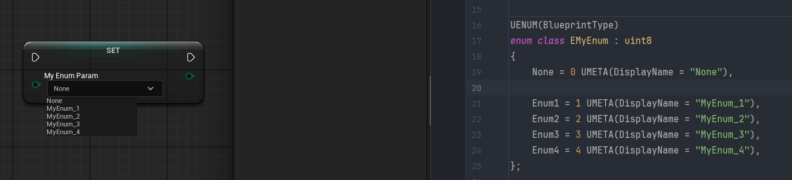
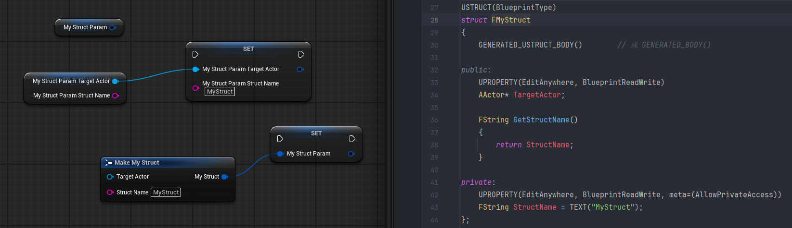
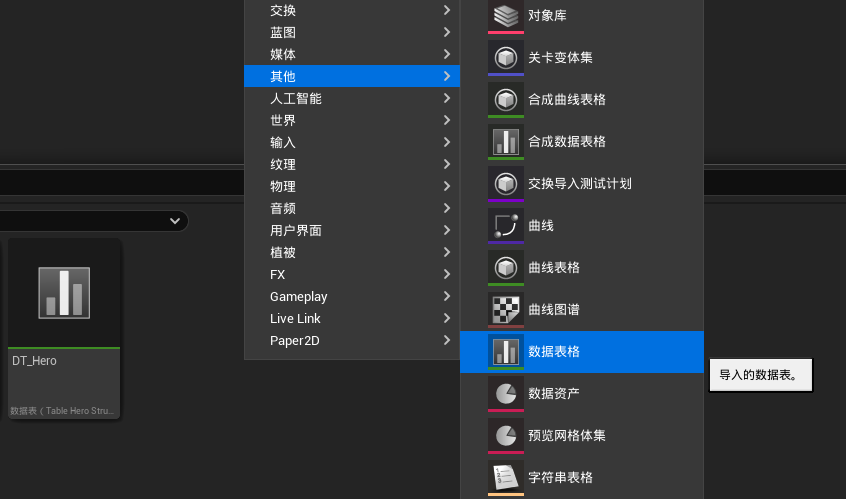
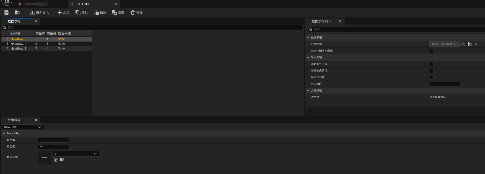
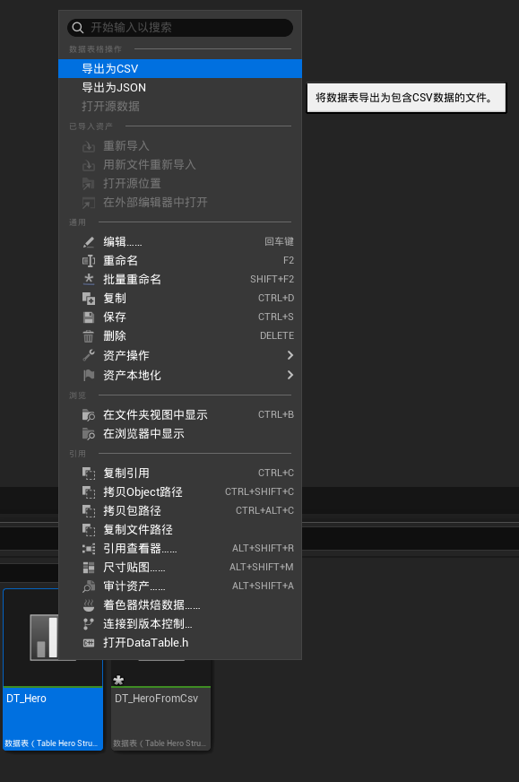
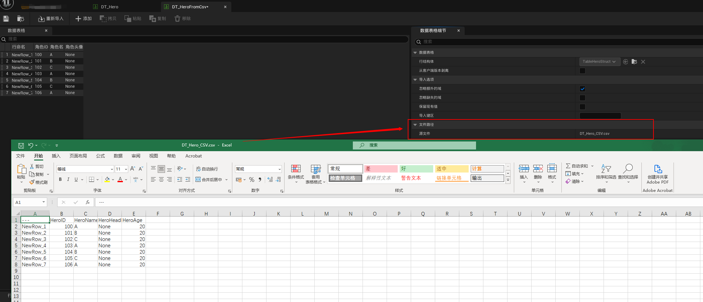

# Unreal Engine流程相关

## Unreal Engine的 启动流程


### 参考文章

- [Unreal Engine 的启动流程 - 放牛的星星 - 知乎](https://zhuanlan.zhihu.com/p/610523485)


# C++与蓝图

## 反射

反射（Reflection）是指一种机制，它允许程序 **在运行时 动态地查询或操作对象的属性、函数和其他元信息**

**UE反射核心步骤：**

1. 标记 UE反射宏：
   - `UObject`：UE所有反射的基类
   - `UClass` 标记类、`USTRUCT` 标记结构体、`UPROPERTY` 标记属性、`UFUNCTION` 标记函数 等
2. 反射代码、元数据的生成：
   - UHT（UnrealHeaderTool）在编译阶段解析 UE反射宏 标记的代码，生成 反射相关代码 及 元数据（记录类、属性、方法等信息）
3. 运行时的反射：
   - 运行时，反射系统通过 元数据及反射API 从而进行动态属性访问、方法调用

**UE反射的应用：**

- 序列化：使用反射来读取和写入对象的属性，以便保存和加载游戏状态、资源等
- 编辑器支持：编辑器能够动态地显示和修改对象的属性，而无需调整代码
- 蓝图支持：暴露类、属性、方法给蓝图使用
- 动态操作：运行时根据名字修改属性、调用函数，或动态创建对象

### 参考文章

- [虚幻引擎反射系统 - UnrealEngine](https://dev.epicgames.com/documentation/zh-cn/unreal-engine/reflection-system-in-unreal-engine)
- [UE反射的初步了解 - 知乎](https://zhuanlan.zhihu.com/p/15356040140)
- [UE4 C++与蓝图 反射宏 - 知乎](https://zhuanlan.zhihu.com/p/435698880)
- [UnrealEngine - 反射系统分析 - 博客园](https://www.cnblogs.com/lawliet12/p/17272835.html)
- [【UE 反射】反射的原理是什么？如何使用机制？ - CSDN](https://blog.csdn.net/hhw_hhw/article/details/139287867)


## 标识符

标识符介绍：[UE5标识符详解 - 知乎 - 大钊](https://zhuanlan.zhihu.com/p/717920216)

常用标识符查阅手册：[UnrealSpecifiers | UE5标识符详解 - Github - 大钊](https://github.com/fjz13/UnrealSpecifiers)

### UCLASS

声明类时，可以为声明添加 **类说明符**，以控制类相对于引擎和编辑器的各个方面的行为

官方文档：[类说明符 - UnrealEngine](https://dev.epicgames.com/documentation/zh-cn/unreal-engine/class-specifiers)

```c++
UCLASS(Blueprintable, BlueprintType)
class DEMO_UE_API AMyActor : public AActor
{
	GENERATED_BODY()

public:
	// Sets default values for this actor's properties
	AMyActor();

protected:
	// Called when the game starts or when spawned
	virtual void BeginPlay() override;

public:
	// Called every frame
	virtual void Tick(float DeltaTime) override;
};
```

### UPROPERTY

声明属性时，**属性说明符** 可被添加到声明，以控制属性与引擎和编辑器诸多方面的相处方式

官方文档：[属性说明符 - UnrealEngine](https://dev.epicgames.com/documentation/zh-cn/unreal-engine/property-specifiers?application_version=4.27)

```c++
protected:
	UPROPERTY(VisibleAnywhere, BlueprintReadOnly, Category="Test", DisplayName="参数A", meta=(ToolTip="这是 参数A"))
	int32 ParamA = 10;

private:
	UPROPERTY(EditAnywhere, BlueprintReadWrite, Category="Test", DisplayName="参数B", meta=(ToolTip="这是 参数B", AllowPrivateAccess=true))
	int32 ParamB = 20;
```


### UFUNCTION

声明函数时，可以为声明添加 **函数说明符**，以控制函数相对于引擎和编辑器的各个方面的行为方式

官方文档：[函数说明符 - UnrealEngine](https://dev.epicgames.com/documentation/zh-cn/unreal-engine/ufunctions-in-unreal-engine?application_version=5.5)

```c++
UFUNCTION(BlueprintPure)
float  BlueprintPureFunction;

UFUNCTION(BlueprintCallable)
float BlueprintCallableFunction

UFUNCTION(BlueprintCallable)
int32 BlueprintCallableConstFunction() const

UFUNCTION(BlueprintPure=fasle)
Int32 BlueprintPureFalseFunction() const
```


### 参考文章

- [类说明符 - UnrealEngine](https://dev.epicgames.com/documentation/zh-cn/unreal-engine/class-specifiers)
- [属性说明符 - UnrealEngine](https://dev.epicgames.com/documentation/zh-cn/unreal-engine/property-specifiers?application_version=4.27)
- [函数说明符 - UnrealEngine](https://dev.epicgames.com/documentation/zh-cn/unreal-engine/ufunctions-in-unreal-engine?application_version=5.5)
- [元数据说明符 - UnrealEngine](https://dev.epicgames.com/documentation/zh-cn/unreal-engine/metadata-specifiers-in-unreal-engine?application_version=5.5)
- [UE4 C++学习 浅析UProperty属性说明符 - CSDN](https://www.cnblogs.com/CatSevenMillion/p/16637347.html)


## Marcro 宏

|       宏       |    适用地点     |                  说明                   |
| :------------: | :-------------: | :-------------------------------------: |
|     UCLASS     | UObject的派生类 | 标记从 UObject 派生的类，以被UE反射识别 |
| GENERATED_BODY | UObject的派生类 |     配合UCLASS、生成UE反射相关代码      |
|   UPROPERTY    |    标记属性     |  被UE反射识别，进而反映到 编辑器、蓝图  |
|   UFUNCTION    |    标记函数     |  被UE反射识别，进而反映到 编辑器、蓝图  |

## 容器

|  容器  |           描述           |      |
| :----: | :----------------------: | :--: |
| TArray |         动态数组         |      |
|  TMap  |        键值对容器        |      |
|  TSet  | 快速容器，元素本身作为键 |      |

TArray：

```c++
// 创建
TArray<int32> MyArray;
MyArray.Init(0, 5);

// 添加元素
MyArray.Add(10);
MyArray.Emplace(20);
MyArray.Append({30, 40});
MyArray.EmplaceAt(0, 50);
MyArray.Insert(100, 1);
MyArray.AddZeroed();

// 修改元素
if (MyArray.IsValidIndex(MyArray.Num() - 1))
    MyArray[MyArray.Num()-1] = 999;

// 删除元素
MyArray.Append({ 1, 2, 2, 2, 3, 3});
MyArray.RemoveAt(0);
MyArray.RemoveSingle(2);
MyArray.Remove(2);
MyArray.RemoveAll([](const int& num)
{
	return num == 3;
});

// 遍历
for (int i = 0; i < MyArray.Num(); i++)
    UE_LOG(LogTemp, Display, TEXT("%d"), MyArray[i]);
for (int32 a : MyArray)
    UE_LOG(LogTemp, Log, TEXT("%d"), a);
for (auto it = MyArray.CreateConstIterator(); it; ++it)
    UE_LOG(LogTemp, Log, TEXT("%d"), *it);

// 查找元素
if (MyArray.Contains(10))
    UE_LOG(LogTemp, Log, TEXT("MyArray.Contains"));
if (MyArray.Find(10) != INDEX_NONE)
    UE_LOG(LogTemp, Log, TEXT("MyArray.Find"));

// 排序
MyArray.Sort([](const int& a, const int& b)
{
	return a < b;
});
```

TMap：

```c++
// 创建
TMap<int, FString> MyMap;
MyMap = {
    {0, "0"},
};

// 添加元素
MyMap.Add(1, "0");
MyMap.Add(1, "1");	//已有key，则替换value
MyMap.Emplace(6, "5");
MyMap.Emplace(6, "6");	//已有key，则替换value

// 信息
UE_LOG(LogTemp, Log, TEXT("IsEmpty = %hhd"), MyMap.IsEmpty());
UE_LOG(LogTemp, Log, TEXT("Num = %d"), MyMap.Num());

// 查找
if (MyMap.Contains(6))
    UE_LOG(LogTemp, Log, TEXT("Contains 6"));
FString* mapFindResultPtr = MyMap.Find(6);
if (mapFindResultPtr != nullptr)
    UE_LOG(LogTemp, Log, TEXT("Find 6"));

// 遍历
for (const TPair<int, FString>& Pair : MyMap)
    UE_LOG(LogTemp, Log, TEXT("Key = %d, Val = %s"), Pair.Key, *Pair.Value);

// 删除元素
MyMap.Add(10, "10");
MyMap.Add(11, "11");
FString delVal1 = MyMap.FindAndRemoveChecked(10);
FString delVal2 = "-1";
if (MyMap.RemoveAndCopyValue(11, delVal2))
    UE_LOG(LogTemp, Log, TEXT("RemoveAndCopyValue = %s"), *delVal2);

// 清空元素
MyMap.Reset();	//移除全部元素 但 内存尚在
MyMap.Empty();	//移除全部元素 且 释放内存
```

TSet：

```c++
// 创建
TSet<FString> MySet;
MySet = { "A", "B" };

// 信息
UE_LOG(LogTemp, Log, TEXT("MySet.IsEmpty() = %hhd"), MySet.IsEmpty());
UE_LOG(LogTemp, Log, TEXT("MySet.Num() = %d"), MySet.Num());

// 添加元素
MySet.Add("B");
MySet.Add("C");
MySet.Emplace("C");
MySet.Emplace("D");
MySet.Append({"D", "E", "F"});
UE_LOG(LogTemp, Log, TEXT("After add element MySet.Num() = %d"), MySet.Num());

// 查找
UE_LOG(LogTemp, Log, TEXT("MySet.Contains(\"A\") = %hhd"), MySet.Contains("A"));
FString* setFindResultPtr = MySet.Find("A");
if (setFindResultPtr != nullptr)
    UE_LOG(LogTemp, Log, TEXT("MySet.Find(\"A\")"));

// 删除元素
UE_LOG(LogTemp, Log, TEXT("MySet.Remove(\"A\") = %d"), MySet.Remove("A"));
UE_LOG(LogTemp, Log, TEXT("MySet.Remove(\"A\") = %d"), MySet.Remove("A"));

// 清空元素
MySet.Reset();	//移除全部元素 但 内存尚在
MySet.Empty();	//移除全部元素 且 释放内存
```

### 参考文章

- [[UE C++] TArray - CSDN](https://blog.csdn.net/qq_52179126/article/details/130605021)
- [[UE C++] TMap - CSDN](https://blog.csdn.net/qq_52179126/article/details/130712877)

- [[UE C++] TSet - CSDN](https://blog.csdn.net/qq_52179126/article/details/130756860)


## 字符串

|  类型   |                      描述                       |                  备注                   |
| :-----: | :---------------------------------------------: | :-------------------------------------: |
| FString |               可变字符串。较常用                |                                         |
|  FName  | 不可变字符串，不区分大小写。常用于 标识资源路径 | 因不区分大小写，故从FString转换可能损耗 |
|  FText  |         不可变字符串。常用于 本地化文本         |                                         |

> TEXT宏：让UE自动选择适合当前平台环境的编码。只要是代码内的字符串，都应该用TEXT包裹

FString：

```c++
// FString
FString TestHUDString = FString(TEXT("This is my test FString."));

// 查找
FString TestSearchString = FString(TEXT("This is my test FString."));
if (TestSearchString.Contains(TEXT("Test"), ESearchCase::IgnoreCase, ESearchDir::FromEnd))
    UE_LOG(LogTemp, Warning, TEXT("%s"), *TestSearchString);

if (TestSearchString.Find(TEXT("test"), ESearchCase::CaseSensitive, ESearchDir::FromEnd) != INDEX_NONE)
    UE_LOG(LogTemp, Warning, TEXT("%s"), *TestSearchString);

// 拼接
FString TestConcatString = FString(TEXT("Hello"));
TestConcatString += " ";
TestConcatString += FString(TEXT("World"));

// Printf
int32 NumMinutes = 10;
int32 NumSeconds = 20;
FString TestPrintfString = FString::Printf(TEXT("%02d:%02d  %s"), NumMinutes, NumSeconds, *TestHUDString);


// FString -> FName、FText
FName TestHUDName = FName(*TestHUDString);	//FString -> FName不可靠。因为FName不区分大小写，所以转换存在损耗。
FText TestHUDText = FText::FromString(TestHUDString);

// FName、FText -> FString
TestHUDString = TestHUDName.ToString();
TestHUDString = TestHUDText.ToString();
```

FName：

```c++
// FNames：不区分大小写、不可变，且无法被操作
FName TestHUDName = FName(TEXT("ThisIsMyTestFName"));
FName TestHUDNameFromFString = FName(*FString(TEXT("THISISMYTESTFNAME")));

// 比较（注意：均为忽略大小写的）
if (TestHUDName == TestHUDNameFromFString) {}
if (TestHUDName.IsEqual(FName(TEXT("THISISMYTESTFNAME")))) {}


// FName -> FString、FText
FString TestHUDString = TestHUDName.ToString();
FText TestHUDText = FText::FromName(TestHUDName);

// FString -> FName
// 注意：因为FName不区分大小写，所以转换存在损耗
TestHUDName = FName(*TestHUDString);
UE_LOG(LogTemp, Warning, TEXT("%s"), *TestHUDName.ToString());
```

FText：

```c++
// FText
FText TestHUDText = FText::FromString(TEXT("ThisIsMyTestFText"));
```

三者转换：


### 参考文章

- [字符串处理 - UnrealEngine](https://dev.epicgames.com/documentation/zh-cn/unreal-engine/string-handling-in-unreal-engine)
- [FString、FName、FText的基本使用 - CSDN](https://blog.csdn.net/ChaoChao66666/article/details/144568057)
- [UE4 C++基础 - 字符串和本地化 - 知乎](https://zhuanlan.zhihu.com/p/163587790)


## 枚举

```c++
UENUM(BlueprintType)			// 标记蓝图可用
enum class EMyEnum : uint8		// 不加默认为int
{
	None = 0 UMETA(DisplayName = "None"),	// 蓝图要求 必须含有val=0的枚举值

	Enum1 = 1 UMETA(DisplayName = "MyEnum_1"),	// 修改显示名称
	Enum2 = 2 UMETA(DisplayName = "MyEnum_2"),
	Enum3 = 3 UMETA(DisplayName = "MyEnum_3"),
	Enum4 = 4 UMETA(DisplayName = "MyEnum_4"),
};

// 用法
EMyEnum MyEnum = EMyEnum::Enum1;
const UEnum* EnumPtr = FindObject<UEnum>(ANY_PACKAGE, TEXT("EMyEnum"), true);
if (EnumPtr != nullptr)
{
    // 获取 枚举值对应 枚举名（无效则返 空值）
    EnumPtr->GetNameStringByValue(2);		// "Enum2"
    // 获取 枚举名对应 枚举值（无效则返 -1）
    EnumPtr->GetValueByNameString(FString("Enum3"));	// 3
    // 判断 枚举值的 合法性
    EnumPtr->IsValidEnumValue(4);		// true
    EnumPtr->IsValidEnumValue(9999);	// false
    // 获取 最大枚举值
    EnumPtr->GetMaxEnumValue();
}
```



### 参考文章

- [[UE C++] Enum的使用 - CSDN](https://blog.csdn.net/qq_52179126/article/details/129891590)


## 结构体

```c++
USTRUCT(BlueprintType)				// 标记蓝图可用
struct FMyStruct
{
	GENERATED_USTRUCT_BODY()		// 或 GENERATED_BODY()

public:
	UPROPERTY(EditAnywhere, BlueprintReadWrite)
	AActor* TargetActor;

	FString GetStructName()			// 结构体的 成员函数 仅能在C++层用，蓝图无法使用
	{
		return StructName;
	}

private:
	UPROPERTY(EditAnywhere, BlueprintReadWrite, meta=(AllowPrivateAccess))
	FString StructName = TEXT("MyStruct");
};

// 用法
FMyStruct MyStruct = FMyStruct();
UE_LOG(LogTemp, Warning, TEXT("StructName = %s"), *MyStruct.GetStructName());
```



### 参考文章

- [UE C++ Struct 的使用 - CSDN](https://blog.csdn.net/qq_52179126/article/details/129768456)


## 数据表 DataTables

数据表是一种表格，表中的数据字段可以是任何有效的 `UObject` 属性，包括资产引用。数据表可 导入/导出 为CSV或JSON

### 创建数据表

表格由列名组成，列名源自 `FTableRowBase` 的派生类，例如：

```c++
// 角色数据表
USTRUCT(Blueprintable)
struct FTableHeroStruct : public FTableRowBase
{
    GENERATED_BODY()

    FTableHeroStruct()
    : HeroID(0)
    , HeroName(TEXT("NONE"))
    {}

    UPROPERTY(EditDefaultsOnly, BlueprintReadWrite, Category= "BaseInfo", DisplayName="角色ID")
    int32 HeroID;

    UPROPERTY(EditDefaultsOnly, BlueprintReadWrite, Category= "BaseInfo", DisplayName="角色名")
    FName HeroName;

    UPROPERTY(EditDefaultsOnly, BlueprintReadWrite, Category= "BaseInfo", DisplayName="角色头像")
    TSoftObjectPtr<UTexture> HeroHeadIcon;
};
```

声明完 `FTableHeroStruct : FTableRowBase` 结构体后，就可创建 **数据表格** 资产（本例的表格类型为 `FTableHeroStruct`）：



打开 数据表格 资产后，即可进行表格项编辑：



注意：

- 表格的 行命名（RowName）全表唯一，不可重复

### 数据表操作

加载数据表：

```c++
// 加载数据表
UDataTable* MyHeroTable = LoadObject<UDataTable>(NULL, TEXT("DataTable'/Game/DT_Hero.DT_Hero'"));
if (MyHeroTable != nullptr) {}
```

表内容读取：

```c++
UDataTable* MyHeroTable = LoadObject<UDataTable>(NULL, TEXT("DataTable'/Game/DT_Hero.DT_Hero'"));
if (MyHeroTable != nullptr)
{
    // 读表 - GetRowMap()
    for (TPair<FName, unsigned char*> it : MyHeroTable->GetRowMap())
    {
        FTableHeroStruct* RowPtr = (FTableHeroStruct*)it.Value;
        UE_LOG(LogTemp, Log, TEXT("MyHeroTable - GetRowMap : it.Key = %s, HeroID = %d, HeroName = %s"), *it.Key.ToString(), RowPtr->HeroID, *RowPtr->HeroName.ToString());
    }

    // 读表 - GetAllRows()
    TArray<FTableHeroStruct*> TableHeroArr;
    MyHeroTable->GetAllRows("", TableHeroArr);
    for (FTableHeroStruct* RowPtr : TableHeroArr)
    {
        UE_LOG(LogTemp, Log, TEXT("MyHeroTable - GetAllRows : HeroID = %d, HeroName = %s"), RowPtr->HeroID, *RowPtr->HeroName.ToString());
    }

    // 读表 - FindRow()
    for (FName RowName : MyHeroTable->GetRowNames())
    {
        FTableHeroStruct* RowPtr = MyHeroTable->FindRow<FTableHeroStruct>(RowName, TEXT(""));
        UE_LOG(LogTemp, Log, TEXT("MyHeroTable - FindRow : RowName = %s, HeroID = %d, HeroName = %s"), *RowName.ToString(), RowPtr->HeroID, *RowPtr->HeroName.ToString());
    }

    // 遍历
    MyHeroTable->ForeachRow<FTableHeroStruct>(TEXT(""), [](const FName& Key, const FTableHeroStruct& RowRef)
    {
		UE_LOG(LogTemp, Log, TEXT("MyHeroTable - ForeachRow : Key = %s, HeroID = %d, HeroName = %s"), *Key.ToString(), RowRef.HeroID, *RowRef.HeroName.ToString());
    });
}
```

表内容 新加、移除：

```c++
UDataTable* MyHeroTable = LoadObject<UDataTable>(NULL, TEXT("DataTable'/Game/DT_Hero.DT_Hero'"));
if (MyHeroTable != nullptr)
{
    // 写入表项：
    FName RowName = FName(TEXT("NewRow_99"));
    if (!MyHeroTable->FindRow<FTableHeroStruct>(RowName, TEXT("")))
    {
        FTableHeroStruct* DataTableRowInfo = new FTableHeroStruct();
        DataTableRowInfo->HeroID = 999;
        DataTableRowInfo->HeroName = TEXT("NewHero");

        MyHeroTable->AddRow(RowName, *DataTableRowInfo);
    }
    else
    {
        //已有RowName，再AddRow会覆写内容
        //MyHeroTable->AddRow(RowName, *DataTableRowInfo);
    }

    // 删除表项：
    MyHeroTable->RemoveRow(RowName);
}
```

### 数据表导入导出

目前支持 数据表 到 CSV、JSON 的相互转换。例如 将 表格数据 资产 转换为CSV：



将 CSV 转换为 表格资产：

（对于CSV、JSON内的 非匹配、缺失列字段，可设置表格资产内的 导入选项 的相关参数）



### 参考文章

- [数据驱动的Gameplay元素 - UnrealEngine](https://dev.epicgames.com/documentation/zh-cn/unreal-engine/data-driven-gameplay-elements-in-unreal-engine?application_version=5.5)
- [UE5中的数据表：UDataTable - 知乎](https://zhuanlan.zhihu.com/p/567901416)
- [[UE C++] Data Table的使用 - CSDN](https://blog.csdn.net/qq_52179126/article/details/129800615)


## 委托

委托是一种泛型但类型安全的方式，可在C++对象上调用成员函数。UE常用的委托有3类：

|    委托类型     |                          描述                          |                        备注                         |
| :-------------: | :----------------------------------------------------: | :-------------------------------------------------: |
|    单播委托     |        绑定在单个对象的单个函数上，一一映射触发        |                                                     |
|    多播委托     | 可绑定到 多个 不同对象的不同函数，按照绑定顺序执行触发 |                                                     |
| 动态单/多播委托 |           与单播、多播委托相比，多了蓝图交互           | 以 UPROPERTY(BlueprintAssignable) 标记 动态多播委托 |

用法：

- [单播委托的基本使用 - CSDN](https://zhichao.blog.csdn.net/article/details/144314544)
- [多播委托的基本使用 - CSDN](https://zhichao.blog.csdn.net/article/details/144510562)
- [动态单播/多播的基本使用 - CSDN](https://zhichao.blog.csdn.net/article/details/144543843)

### 参考文章

- [委托 - UnrealEngine](https://dev.epicgames.com/documentation/zh-cn/unreal-engine/delegates-and-lambda-functions-in-unreal-engine?application_version=5.5)
- [动态委托基本用法（单播，多播） - 知乎](https://zhuanlan.zhihu.com/p/27732328690)


## 断言

`assert` 可在 开发期间 帮助检测和诊断不正常或无效的运行时条件

基本格式为：`assert(表达式)`，表达式=false=触发断言

| 断言类型 |         当触发断言         |                     版本区别                     |                             备注                             |
| :------: | :------------------------: | :----------------------------------------------: | :----------------------------------------------------------: |
|  check   |          中断运行          |        发布版本内 不断言 且 不执行表达式         | USE_CHECKS_IN_SHIPPING宏 = 标识断言检查 在发布版本内是否执行，默认为0，可按需设置 |
|  verify  |          中断运行          |         发布版本内 不断言 但 执行表达式          |                                                              |
|  ensure  | 可继续运行，可打印堆栈信息 | 所有版本都执行表达式 但 非发布版本才打印堆栈信息 |                   会将检测结果以bool值返回                   |

断言选择：


### 参考文章

- [断言 - UnrealEngine](https://dev.epicgames.com/documentation/zh-cn/unreal-engine/asserts-in-unreal-engine?application_version=5.5)
- [UE4断言总结 - 知乎](https://zhuanlan.zhihu.com/p/64462945)


## 事件、函数、宏

**事件** 侧重于 逻辑触发，**函数** 侧重于 即时的逻辑执行及结果返回，**宏** 侧重于 逻辑分流处理


### 参考文章

- [【UE4】函数、宏和事件的区别 - 知乎](https://zhuanlan.zhihu.com/p/527787878)
- [UE5 ＜事件、函数、宏＞ - CSDN](https://blog.csdn.net/CandyU2/article/details/147124582)


## DrawDebug

DrawDebug 用于在 编辑器或开发环境下，于场景内绘制 图形或文字，以便直观查验信息

相关绘制方法（C++或蓝图都有）均使用的 `UKismetSystemLibrary` 内的API：


效果示例：


### 参考文章

- [虚幻引擎中各种场景调试绘制指令（DrawDebug）的使用、效果和原理 - 知乎](https://zhuanlan.zhihu.com/p/718494965)


## TObjectPtr

UE5 引入了 `TObjectPtr<T>`以替代原始指针`T*`，目的在于：

- 提供 编辑器 下的 动态解析 和 访问追踪功能
- 非编辑器模式下 `TObjectPtr<T>` 会退化为 `T*` ，无性能影响

```c++
// UE 4
class ENGINE_API AActor : public UObject
{
	USceneComponent* RootComponent;
}

// UE 5
class ENGINE_API AActor : public UObject
{
	TObjectPtr<USceneComponent> RootComponent;
}
```

因此在开发中，建议对 `UOject`指针属性、`UClass`及`USTRUCT`内的容器类等 使用 `TObjectPtr<T>`以替代原始指针

```c++
UPROPERTY()
TObjectPtr<AActor> MyActor;
UPROPERTY()
TArray<TObjectPtr<AActor>> MyActorArr;
```

### 参考文章

- [C++ Object Pointer Properties - UnrealEngine](https://dev.epicgames.com/documentation/en-us/unreal-engine/unreal-engine-5-migration-guide?application_version=5.0#c++objectpointerproperties)
- [简析UE5的对象指针FObjectPtr与TObjectPtr - 知乎](https://zhuanlan.zhihu.com/p/504115127)
- [ue 为啥要用TObjectPtr＜T＞ - CSDN](https://blog.csdn.net/u013768914/article/details/144094068)


# 输入

UE中的输入可分为 UE5前的旧版输入、UE5后的EnhancedInput增强输入：

- 旧版输入：
  - 特点：输入映射的基本功能（按键、轴绑定），复杂输入机制（双击、联合输入等）则需要业务层自行处理
- Enhanced Input：
  - 特点：
    - 兼容旧版输入映射
    - 将用户输入到事件处理拆分为不同模块处理：**输入动作（UInputAction）**、**输入修改器（UInputModifier）**、**输入触发器（UInputTrigger）**和 **输入映射环境（UInputMappingContext）**，以asset方式进行配置

## Enhanced Input 增强输入

基础用法示例：[虚幻5新特性之EnhancedInput - CSDN](https://blog.csdn.net/xcinkey/article/details/124755202)、[虚幻引擎5：增强输入的使用方法 - CSDN](https://blog.csdn.net/chai_tian/article/details/133818478)

通过配置目标InputAction的触发器，可实现不同输入行为的 各类触发事件（见下图）。对于触发器的配置可参阅：[虚幻UE 增强输入-触发器 - CSDN](https://blog.csdn.net/weixin_45865901/article/details/135407105)


## 手柄适配

### 手柄映射

摇杆的X、Y轴 = 单轴向上的 `float` 值

摇杆的2D轴 = X、Y两个轴向上的 `FVector2D` 值


## 参考文章

- [UE5 -- EnhancedInput(增强输入系统) - 知乎](https://zhuanlan.zhihu.com/p/470949422)
- [虚幻5新特性之EnhancedInput - CSDN](https://blog.csdn.net/xcinkey/article/details/124755202)
- [虚幻引擎5：增强输入的使用方法 - CSDN](https://blog.csdn.net/chai_tian/article/details/133818478)
- [增强输入 - UnrealEngine](https://dev.epicgames.com/documentation/zh-cn/unreal-engine/enhanced-input-in-unreal-engine?application_version=5.5)
- [虚幻UE 增强输入-触发器 - CSDN](https://blog.csdn.net/weixin_45865901/article/details/135407105)


# UMG

## Widget的生命周期

涉及方法主要有：

```c++
bool Initialize()
void NativeOnInitialized()
    
void AddToScreen(ULocalPlayer* LocalPlayer, int32 ZOrder)
    
void NativePreConstruct()
void NativeConstruct()
    
void NativeTick()
    
void RemoveFromParent()
void NativeDestruct()
```

但在 编辑器 及 Game/PIE 下，会有调用区别：

- Game/PIE：
  - 运行：`bool Initialize()` -> `void NativeOnInitialized()` -> `void AddToScreen(ULocalPlayer* LocalPlayer, int32 ZOrder)` -> `void NativePreConstruct()` -> `void NativeConstruct()` -> `void NativeTick()` -> `void RemoveFromParent()` -> `void NativeDestruct()`

- 编辑器下：
  - 打开预览UMG：`bool Initialize()` -> `void NativePreConstruct()`
  - 保存UMG：`bool Initialize()`
  - UMG内控件调整：`bool Initialize()` -> `void NativePreConstruct()`

基于上述区别，在控件初始化、绑定时，需要区分处理：

```c++
// 若是在 编辑器 下就绑定、预览控件的：
bool Initialize()	//控件绑定
void NativePreConstruct()   //控件使用（设置文字颜色、按钮事件绑定...）

// 若是在 Game 下才绑定、预览控件的：
void NativeConstruct()	//控件绑定、控件使用
// 也可以 void NativeOnInitialized() 进行控件绑定，void NativeConstruct() 使用控件
```

### 参考文章

- [UMG生命周期 - 博客园](https://www.cnblogs.com/sin998/p/15490311.html)
- [[UEC++]UMG的构建函数 - CSDN](https://blog.csdn.net/q757745037/article/details/143270863)
- [UE4 UMG中C++成员变量绑定蓝图Widget - 知乎](https://zhuanlan.zhihu.com/p/337908390)


# Level

[关卡（Level）](https://dev.epicgames.com/documentation/zh-cn/unreal-engine/levels-in-unreal-engine) 是游戏的“世界”的全部或一部分。关卡包含玩家可以看到并与之交互的所有内容，例如环境、可用对象、其他角色，等等

对于 [Level的管理方式](https://dev.epicgames.com/documentation/zh-cn/unreal-engine/managing-multiple-levels-in-unreal-engine)，目前有2类：

- UE4的 **Level Streaming（关卡流送）**：一个Persistant Level + 多个SubLevel。SubLevel 可通过 关卡流送体积 或 代码/蓝图调用 实现加载、显示、卸载
- UE5新增的 **World Partition（世界分区）**：一个World Partition的Level。通过区域网格划分，自动流送相关区域

## Level Streaming 关卡流送

> 关卡流送功能 可以**将地图文件加载到内存中，或者从内存中卸载**，并在游戏过程中**切换地图的可视性**
>
>  这样一来，场景便能拆分为较小的地图块，并且只有相关部分才会占用资源并被渲染。 正确设置后，开发者便能创建大型、无缝衔接的游戏场景，让玩家仿佛置身于"大世界"之中

根据Level的关系，可划分为2类：

- **Persistent Level（持久关卡）**：核心关卡，始终加载，负责管理其他子关卡的动态加载/卸载。通常为 包含基础场景元素（关照、天空盒）的Level
- **Streaming Levels（流送关卡）**：通过流送体积（Level Streaming Volumes）、蓝图或代码动态加载的子关卡，按需加载/卸载

对于一个 子关卡/流送关卡，其流送方式（**Change Streaming Method**）有：

- **固定加载（Always Loaded）**：与所属的 持久关卡（Persistent Level） 一同加载 且 变为可视状态。不受 流送体积域、蓝图、C++的操作影响。常用作 **持久关卡内容拆分的关卡**
- **蓝图（Blueprint）**：关卡通过 **关卡流送体积(Level Streaming Volumes)** 、 **蓝图** 或 **C++代码** 来动态加载、卸载或流送。常用于 **按需动态处理的关卡**

### 参考文章

- [关卡流送概述 - UnrealEngine](https://dev.epicgames.com/documentation/zh-cn/unreal-engine/level-streaming-overview-in-unreal-engine)

- [【UE教程/进阶】篇——关卡流送（Level Streaming）- CSDN](https://blog.csdn.net/YCEykr/article/details/140769854)

## World Partition 世界分区

> 世界分区 是一种 **自动数据管理和基于距离的关卡流送系统**，为大型世界管理提供了完整的解决方案
>
>  以前需要将单个持久关卡中的世界存储到网格单元格中，以便将大型关卡划分成子关卡，但现在的系统已经不需要如此操作，并且你能够使用自动流送系统，根据与流送源的距离来加载和卸载这些单元格

### 参考文章

- [世界分区 - UnrealEngine](https://dev.epicgames.com/documentation/zh-cn/unreal-engine/world-partition-in-unreal-engine)
- [UE5世界分区 - LioMissBlog](https://liomiss.github.io/2025/02/20/ue-wp/)
- [简单尝试UE5的WorldPartition - CSDN](https://blog.csdn.net/u013412391/article/details/120254269)
- [虚幻引擎(UE5)-大世界分区WorldPartition教程(一) - WP的基本用法 - CSDN](https://blog.csdn.net/oFengtingwano/article/details/130871958)
- [虚幻引擎(UE5)-大世界分区WorldPartition教程(二) - OFPA的用法 - CSDN](https://blog.csdn.net/oFengtingwano/article/details/131432827)
- [虚幻引擎(UE5)-大世界分区WorldPartition教程(三) - LevelInstance的用法 - CSDN](https://blog.csdn.net/oFengtingwano/article/details/131433627)
- [虚幻引擎(UE5)-大世界分区WorldPartition教程(四) - DataLayers的用法 - CSDN](https://blog.csdn.net/oFengtingwano/article/details/131433981)

# 规范

## 资产规范

资产命名规范：

- [UE5项目命名规则](https://docs.qq.com/sheet/DV010ZWxaUmhvbXJs?tab=BB08J2)
- [推荐的资产命名规范 - UnrealEngine](https://dev.epicgames.com/documentation/zh-cn/unreal-engine/recommended-asset-naming-conventions-in-unreal-engine-projects)

## 代码规范

UE内的C++代码规范：

- [代码规范 - UnrealEngine](https://dev.epicgames.com/documentation/zh-cn/unreal-engine/epic-cplusplus-coding-standard-for-unreal-engine?application_version=5.5)
- [UE中的代码命名规范 - CSDN](https://blog.csdn.net/E696472716D4/article/details/143606685)