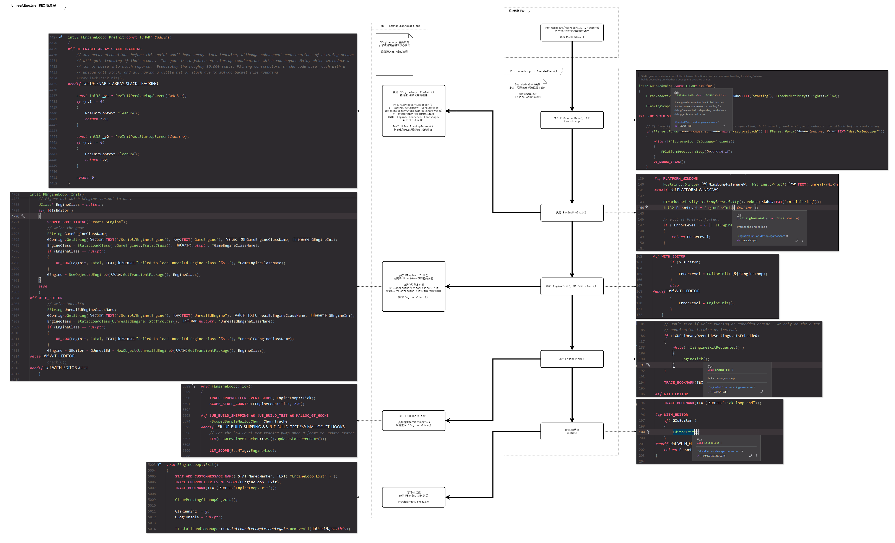
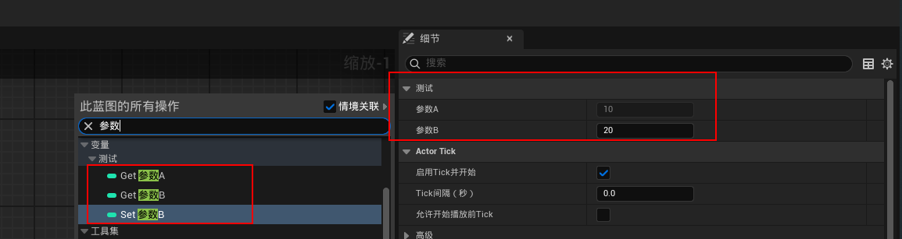
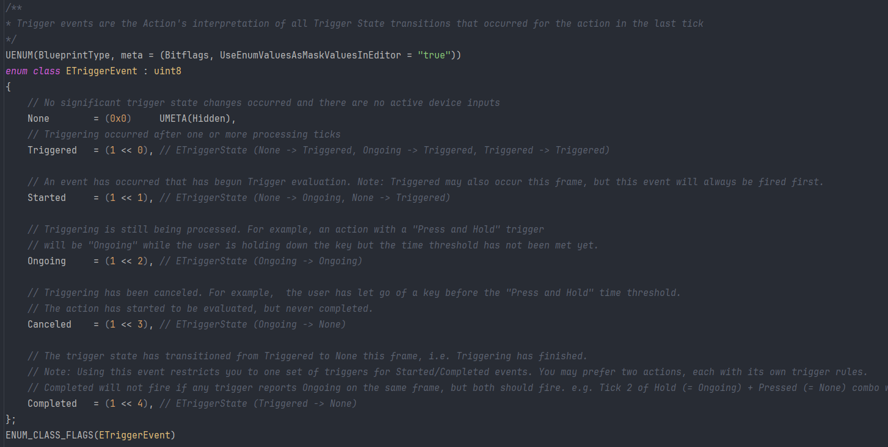
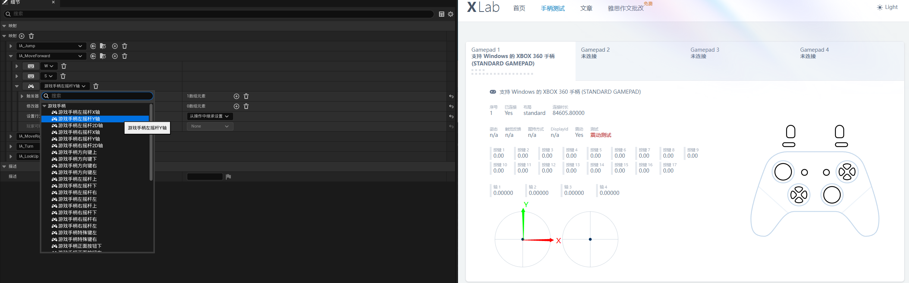

# Unreal Engine流程相关

## Unreal Engine的 启动流程



### 参考文章

- [Unreal Engine 的启动流程 - 放牛的星星 - 知乎](https://zhuanlan.zhihu.com/p/610523485)


# C++与蓝图

## 标识符

标识符介绍：[UE5标识符详解 - 知乎 - 大钊](https://zhuanlan.zhihu.com/p/717920216)

常用标识符查阅手册：[UnrealSpecifiers | UE5标识符详解 - Github - 大钊](https://github.com/fjz13/UnrealSpecifiers)

### UCLASS

声明类时，可以为声明添加 **类说明符**，以控制类相对于引擎和编辑器的各个方面的行为

官方文档：[类说明符 - UnrealEngine](https://dev.epicgames.com/documentation/zh-cn/unreal-engine/class-specifiers)

```c++
UCLASS(Blueprintable, BlueprintType)
class DEMO_UE_API AMyActor : public AActor
{
	GENERATED_BODY()

public:
	// Sets default values for this actor's properties
	AMyActor();

protected:
	// Called when the game starts or when spawned
	virtual void BeginPlay() override;

public:
	// Called every frame
	virtual void Tick(float DeltaTime) override;
};
```

### UPROPERTY

声明属性时，**属性说明符** 可被添加到声明，以控制属性与引擎和编辑器诸多方面的相处方式

官方文档：[属性说明符 - UnrealEngine](https://dev.epicgames.com/documentation/zh-cn/unreal-engine/property-specifiers?application_version=4.27)

```c++
protected:
	UPROPERTY(VisibleAnywhere, BlueprintReadOnly, Category="Test", DisplayName="参数A", meta=(ToolTip="这是 参数A"))
	int32 ParamA = 10;

private:
	UPROPERTY(EditAnywhere, BlueprintReadWrite, Category="Test", DisplayName="参数B", meta=(ToolTip="这是 参数B", AllowPrivateAccess=true))
	int32 ParamB = 20;
```



### UFUNCTION

声明函数时，可以为声明添加 **函数说明符**，以控制函数相对于引擎和编辑器的各个方面的行为方式

官方文档：[函数说明符 - UnrealEngine](https://dev.epicgames.com/documentation/zh-cn/unreal-engine/ufunctions-in-unreal-engine?application_version=5.5)

```c++
UFUNCTION(BlueprintPure)
float  BlueprintPureFunction;

UFUNCTION(BlueprintCallable)
float BlueprintCallableFunction

UFUNCTION(BlueprintCallable)
int32 BlueprintCallableConstFunction() const

UFUNCTION(BlueprintPure=fasle)
Int32 BlueprintPureFalseFunction() const
```


### 参考文章

- [类说明符 - UnrealEngine](https://dev.epicgames.com/documentation/zh-cn/unreal-engine/class-specifiers)
- [属性说明符 - UnrealEngine](https://dev.epicgames.com/documentation/zh-cn/unreal-engine/property-specifiers?application_version=4.27)
- [函数说明符 - UnrealEngine](https://dev.epicgames.com/documentation/zh-cn/unreal-engine/ufunctions-in-unreal-engine?application_version=5.5)
- [元数据说明符 - UnrealEngine](https://dev.epicgames.com/documentation/zh-cn/unreal-engine/metadata-specifiers-in-unreal-engine?application_version=5.5)
- [UE4 C++学习 浅析UProperty属性说明符 - CSDN](https://www.cnblogs.com/CatSevenMillion/p/16637347.html)


## Marcro 宏

|       宏       |    适用地点     |                  说明                   |
| :------------: | :-------------: | :-------------------------------------: |
|     UCLASS     | UObject的派生类 | 标记从 UObject 派生的类，以被UE反射识别 |
| GENERATED_BODY | UObject的派生类 |     配合UCLASS、生成UE反射相关代码      |
|   UPROPERTY    |    标记属性     |  被UE反射识别，进而反映到 编辑器、蓝图  |
|   UFUNCTION    |    标记函数     |  被UE反射识别，进而反映到 编辑器、蓝图  |

## 容器

|  容器  |           描述           |      |
| :----: | :----------------------: | :--: |
| TArray |         动态数组         |      |
|  TMap  |        键值对容器        |      |
|  TSet  | 快速容器，元素本身作为键 |      |

TArray：

```c++
// 创建
TArray<int32> MyArray;
MyArray.Init(0, 5);

// 添加元素
MyArray.Add(10);
MyArray.Emplace(20);
MyArray.Append({30, 40});
MyArray.EmplaceAt(0, 50);
MyArray.Insert(100, 1);
MyArray.AddZeroed();

// 修改元素
if (MyArray.IsValidIndex(MyArray.Num() - 1))
    MyArray[MyArray.Num()-1] = 999;

// 删除元素
MyArray.Append({ 1, 2, 2, 2, 3, 3});
MyArray.RemoveAt(0);
MyArray.RemoveSingle(2);
MyArray.Remove(2);
MyArray.RemoveAll([](const int& num)
{
	return num == 3;
});

// 遍历
for (int i = 0; i < MyArray.Num(); i++)
    UE_LOG(LogTemp, Display, TEXT("%d"), MyArray[i]);
for (int32 a : MyArray)
    UE_LOG(LogTemp, Log, TEXT("%d"), a);
for (auto it = MyArray.CreateConstIterator(); it; ++it)
    UE_LOG(LogTemp, Log, TEXT("%d"), *it);

// 查找元素
if (MyArray.Contains(10))
    UE_LOG(LogTemp, Log, TEXT("MyArray.Contains"));
if (MyArray.Find(10) != INDEX_NONE)
    UE_LOG(LogTemp, Log, TEXT("MyArray.Find"));

// 排序
MyArray.Sort([](const int& a, const int& b)
{
	return a < b;
});
```

TMap：

```c++
// 创建
TMap<int, FString> MyMap;
MyMap = {
    {0, "0"},
};

// 添加元素
MyMap.Add(1, "0");
MyMap.Add(1, "1");	//已有key，则替换value
MyMap.Emplace(6, "5");
MyMap.Emplace(6, "6");	//已有key，则替换value

// 信息
UE_LOG(LogTemp, Log, TEXT("IsEmpty = %hhd"), MyMap.IsEmpty());
UE_LOG(LogTemp, Log, TEXT("Num = %d"), MyMap.Num());

// 查找
if (MyMap.Contains(6))
    UE_LOG(LogTemp, Log, TEXT("Contains 6"));
FString* mapFindResultPtr = MyMap.Find(6);
if (mapFindResultPtr != nullptr)
    UE_LOG(LogTemp, Log, TEXT("Find 6"));

// 遍历
for (const TPair<int, FString>& Pair : MyMap)
    UE_LOG(LogTemp, Log, TEXT("Key = %d, Val = %s"), Pair.Key, *Pair.Value);

// 删除元素
MyMap.Add(10, "10");
MyMap.Add(11, "11");
FString delVal1 = MyMap.FindAndRemoveChecked(10);
FString delVal2 = "-1";
if (MyMap.RemoveAndCopyValue(11, delVal2))
    UE_LOG(LogTemp, Log, TEXT("RemoveAndCopyValue = %s"), *delVal2);

// 清空元素
MyMap.Reset();	//移除全部元素 但 内存尚在
MyMap.Empty();	//移除全部元素 且 释放内存
```

TSet：

```c++
// 创建
TSet<FString> MySet;
MySet = { "A", "B" };

// 信息
UE_LOG(LogTemp, Log, TEXT("MySet.IsEmpty() = %hhd"), MySet.IsEmpty());
UE_LOG(LogTemp, Log, TEXT("MySet.Num() = %d"), MySet.Num());

// 添加元素
MySet.Add("B");
MySet.Add("C");
MySet.Emplace("C");
MySet.Emplace("D");
MySet.Append({"D", "E", "F"});
UE_LOG(LogTemp, Log, TEXT("After add element MySet.Num() = %d"), MySet.Num());

// 查找
UE_LOG(LogTemp, Log, TEXT("MySet.Contains(\"A\") = %hhd"), MySet.Contains("A"));
FString* setFindResultPtr = MySet.Find("A");
if (setFindResultPtr != nullptr)
    UE_LOG(LogTemp, Log, TEXT("MySet.Find(\"A\")"));

// 删除元素
UE_LOG(LogTemp, Log, TEXT("MySet.Remove(\"A\") = %d"), MySet.Remove("A"));
UE_LOG(LogTemp, Log, TEXT("MySet.Remove(\"A\") = %d"), MySet.Remove("A"));

// 清空元素
MySet.Reset();	//移除全部元素 但 内存尚在
MySet.Empty();	//移除全部元素 且 释放内存
```

### 参考文章

- [[UE C++] TArray - CSDN](https://blog.csdn.net/qq_52179126/article/details/130605021)
- [[UE C++] TMap - CSDN](https://blog.csdn.net/qq_52179126/article/details/130712877)

- [[UE C++] TSet - CSDN](https://blog.csdn.net/qq_52179126/article/details/130756860)


## 字符串

|  类型   |                      描述                       |                  备注                   |
| :-----: | :---------------------------------------------: | :-------------------------------------: |
| FString |               可变字符串。较常用                |                                         |
|  FName  | 不可变字符串，不区分大小写。常用于 标识资源路径 | 因不区分大小写，故从FString转换可能损耗 |
|  FText  |         不可变字符串。常用于 本地化文本         |                                         |

> TEXT宏：让UE自动选择适合当前平台环境的编码。只要是代码内的字符串，都应该用TEXT包裹

FString：

```c++
// FString
FString TestHUDString = FString(TEXT("This is my test FString."));

// 查找
FString TestSearchString = FString(TEXT("This is my test FString."));
if (TestSearchString.Contains(TEXT("Test"), ESearchCase::IgnoreCase, ESearchDir::FromEnd))
    UE_LOG(LogTemp, Warning, TEXT("%s"), *TestSearchString);

if (TestSearchString.Find(TEXT("test"), ESearchCase::CaseSensitive, ESearchDir::FromEnd) != INDEX_NONE)
    UE_LOG(LogTemp, Warning, TEXT("%s"), *TestSearchString);

// 拼接
FString TestConcatString = FString(TEXT("Hello"));
TestConcatString += " ";
TestConcatString += FString(TEXT("World"));

// Printf
int32 NumMinutes = 10;
int32 NumSeconds = 20;
FString TestPrintfString = FString::Printf(TEXT("%02d:%02d  %s"), NumMinutes, NumSeconds, *TestHUDString);


// FString -> FName、FText
FName TestHUDName = FName(*TestHUDString);	//FString -> FName不可靠。因为FName不区分大小写，所以转换存在损耗。
FText TestHUDText = FText::FromString(TestHUDString);

// FName、FText -> FString
TestHUDString = TestHUDName.ToString();
TestHUDString = TestHUDText.ToString();
```

FName：

```c++
// FNames：不区分大小写、不可变，且无法被操作
FName TestHUDName = FName(TEXT("ThisIsMyTestFName"));
FName TestHUDNameFromFString = FName(*FString(TEXT("THISISMYTESTFNAME")));

// 比较（注意：均为忽略大小写的）
if (TestHUDName == TestHUDNameFromFString) {}
if (TestHUDName.IsEqual(FName(TEXT("THISISMYTESTFNAME")))) {}


// FName -> FString、FText
FString TestHUDString = TestHUDName.ToString();
FText TestHUDText = FText::FromName(TestHUDName);

// FString -> FName
// 注意：因为FName不区分大小写，所以转换存在损耗
TestHUDName = FName(*TestHUDString);
UE_LOG(LogTemp, Warning, TEXT("%s"), *TestHUDName.ToString());
```

FText：

```c++
// FText
FText TestHUDText = FText::FromString(TEXT("ThisIsMyTestFText"));
```

三者转换：


### 参考文章

- [字符串处理 - UnrealEngine](https://dev.epicgames.com/documentation/zh-cn/unreal-engine/string-handling-in-unreal-engine)
- [FString、FName、FText的基本使用 - CSDN](https://blog.csdn.net/ChaoChao66666/article/details/144568057)
- [UE4 C++基础 - 字符串和本地化 - 知乎](https://zhuanlan.zhihu.com/p/163587790)


## 委托

委托是一种泛型但类型安全的方式，可在C++对象上调用成员函数。UE常用的委托有3类：

|    委托类型     |                          描述                          |                        备注                         |
| :-------------: | :----------------------------------------------------: | :-------------------------------------------------: |
|    单播委托     |        绑定在单个对象的单个函数上，一一映射触发        |                                                     |
|    多播委托     | 可绑定到 多个 不同对象的不同函数，按照绑定顺序执行触发 |                                                     |
| 动态单/多播委托 |           与单播、多播委托相比，多了蓝图交互           | 以 UPROPERTY(BlueprintAssignable) 标记 动态多播委托 |

用法：

- [单播委托的基本使用 - CSDN](https://zhichao.blog.csdn.net/article/details/144314544)
- [多播委托的基本使用 - CSDN](https://zhichao.blog.csdn.net/article/details/144510562)
- [动态单播/多播的基本使用 - CSDN](https://zhichao.blog.csdn.net/article/details/144543843)

### 参考文章

- [委托 - UnrealEngine](https://dev.epicgames.com/documentation/zh-cn/unreal-engine/delegates-and-lambda-functions-in-unreal-engine?application_version=5.5)
- [动态委托基本用法（单播，多播） - 知乎](https://zhuanlan.zhihu.com/p/27732328690)


# 输入

UE中的输入可分为 UE5前的旧版输入、UE5后的EnhancedInput增强输入：

- 旧版输入：
  - 特点：输入映射的基本功能（按键、轴绑定），复杂输入机制（双击、联合输入等）则需要业务层自行处理
- Enhanced Input：
  - 特点：
    - 兼容旧版输入映射
    - 将用户输入到事件处理拆分为不同模块处理：**输入动作（UInputAction）**、**输入修改器（UInputModifier）**、**输入触发器（UInputTrigger）**和 **输入映射环境（UInputMappingContext）**，以asset方式进行配置

## Enhanced Input 增强输入

基础用法示例：[虚幻5新特性之EnhancedInput - CSDN](https://blog.csdn.net/xcinkey/article/details/124755202)、[虚幻引擎5：增强输入的使用方法 - CSDN](https://blog.csdn.net/chai_tian/article/details/133818478)

通过配置目标InputAction的触发器，可实现不同输入行为的 各类触发事件（见下图）。对于触发器的配置可参阅：[虚幻UE 增强输入-触发器 - CSDN](https://blog.csdn.net/weixin_45865901/article/details/135407105)



## 手柄适配

### 手柄映射

摇杆的X、Y轴 = 单轴向上的 `float` 值

摇杆的2D轴 = X、Y两个轴向上的 `FVector2D` 值



## 参考文章

- [UE5 -- EnhancedInput(增强输入系统) - 知乎](https://zhuanlan.zhihu.com/p/470949422)
- [虚幻5新特性之EnhancedInput - CSDN](https://blog.csdn.net/xcinkey/article/details/124755202)
- [虚幻引擎5：增强输入的使用方法 - CSDN](https://blog.csdn.net/chai_tian/article/details/133818478)
- [增强输入 - UnrealEngine](https://dev.epicgames.com/documentation/zh-cn/unreal-engine/enhanced-input-in-unreal-engine?application_version=5.5)
- [虚幻UE 增强输入-触发器 - CSDN](https://blog.csdn.net/weixin_45865901/article/details/135407105)


# 规范

## 资产规范

资产命名规范：

- [UE5项目命名规则](https://docs.qq.com/sheet/DV010ZWxaUmhvbXJs?tab=BB08J2)
- [推荐的资产命名规范 - UnrealEngine](https://dev.epicgames.com/documentation/zh-cn/unreal-engine/recommended-asset-naming-conventions-in-unreal-engine-projects)

## 代码规范

UE内的C++代码规范：

- [代码规范 - UnrealEngine](https://dev.epicgames.com/documentation/zh-cn/unreal-engine/epic-cplusplus-coding-standard-for-unreal-engine?application_version=5.5)
- [UE中的代码命名规范 - CSDN](https://blog.csdn.net/E696472716D4/article/details/143606685)