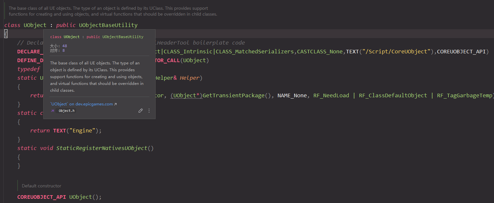
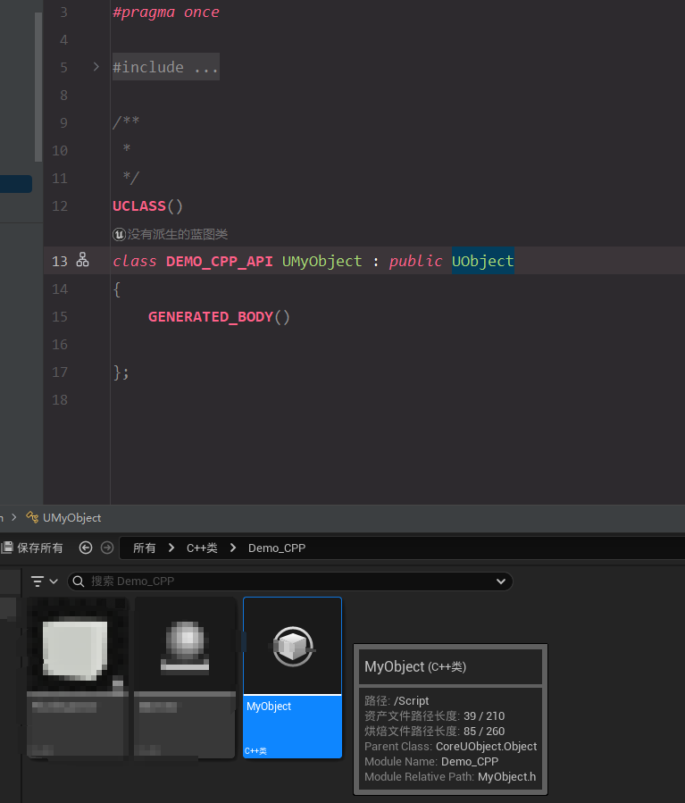
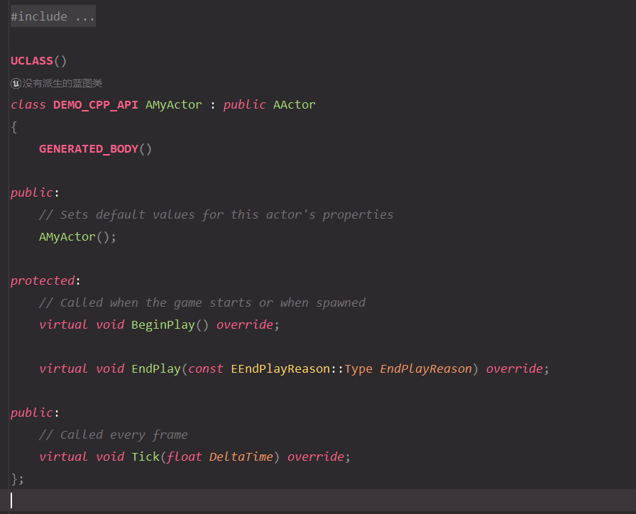
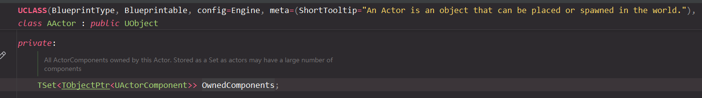
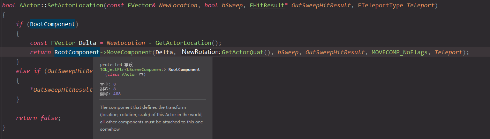
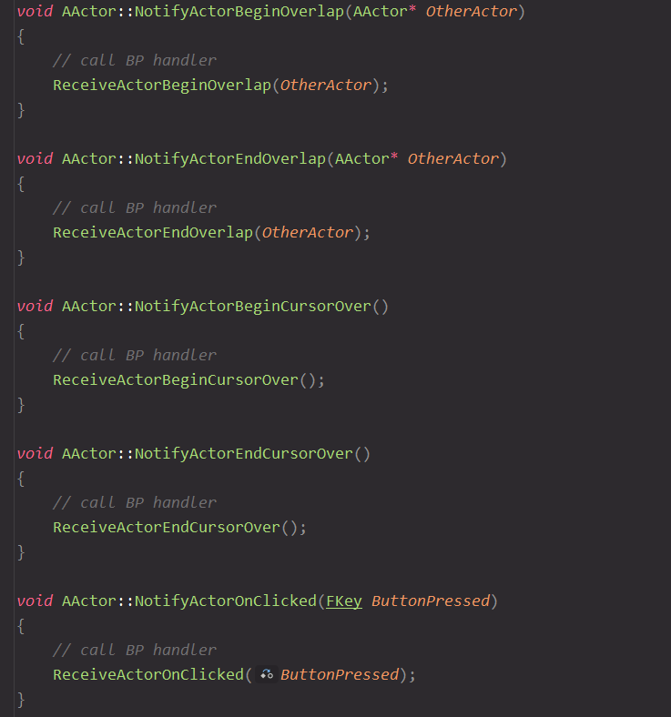
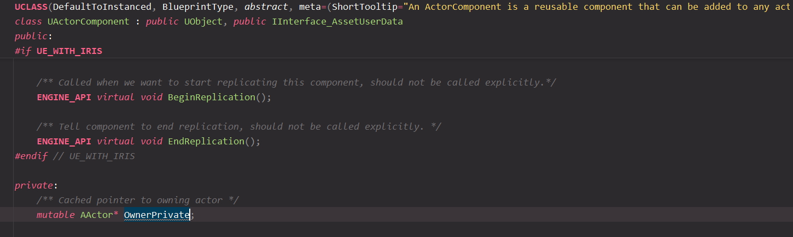
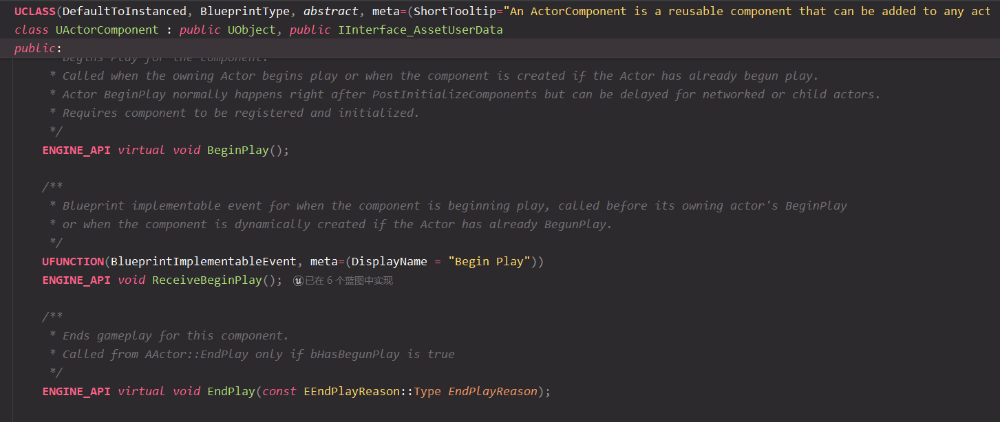

# Unreal Engine - GamePlay框架

## UObject、Actor、Component

### UObject

> UObject是所有UE内物体的基类，其提供了系列基础功能（对象管理、序列化、反射、GC、BP支持、编辑器支持等）供派生类使用

#### UObject的核心功能

- 对象管理：能被UE识别、追踪、管理

- 序列化：能动态加载（如LoadObject()）和序列化到本地（如 `.uasset`文件）
- 反射：允许程序运行时动态查询和操作类和对象信息
- GC：被UE追踪后的对象，才能进入垃圾回收系统
- BP支持：与蓝图对象交互
- 编辑器支持：在编辑器界面显示类的成员

#### UObject的结构

例如 创建一个UObject的派生类 UMyObject 后，其代码结构如下：

其中的 `UCLASS()`宏用于标记此为UObject的派生类、划归UE进行管理

而`GENERATED_BODY()`宏则会 展开生成必要代码以支持UE的反射系统、对UE的属性系统（`UFUNCTION`、`UFUNCTION`）提供支持、等

#### 参考文章

- [《InsideUE4》UObject（一）开篇 ](https://zhuanlan.zhihu.com/p/24319968)
- [Unreal Engine 中 GENERATED_BODY() 的作用](https://blog.csdn.net/gameatp/article/details/145934358)

### Actor

>  Actor派生自UObject，是UE内常用的一个基类，提供了 生命周期、组件搭载、各类交互等功能

#### Actor的核心功能

- 生命周期：
  - BeginPlay：游戏开始或Actor生成时调用
  - EndPlay：游戏结束或Actor销毁调用
  - Tick：每帧调用

- 组件搭载：不同功能的Component可附着到Actor上
  - Actor在场景内的位置、缩放等，就是由 `USceneComponent`类型的`RootComponent`成员实现

- 各类交互：
  - 碰撞、触发事件
  - 玩家输入
  - 蓝图控制

### Component

> UActorComponent 派生自 UObject，用途是 作为特定功能单元，附着到Actor上

#### UActorComponent的核心功能

- 附着到Actor：

- 生命周期：

#### 常用的Component

##### SceneComponent 场景组件

> SceneComponent 派生自 UActorComponent，具备 空间变换（位置、缩放、旋转）、SceneComponent嵌套功能

常见的 `SceneComponent`的派生类由：

- `UStaticMeshComponent`：显示静态网络模型
- `USkeletalMeshComponent`：显示骨骼网络模型
- `UCameraComponent`：相机
- `USpringArmComponent`：弹簧臂
- `UBoxComponent` / `USphereComponent `/ `UCapsuleComponent`：碰撞/触发器

##### UActorComponent的派生类

- `UAudioComponent`：播放音效

- `UPhysicsComponent`：实现物理行为

- `UTimelineComponent`：实现动画时间轴

- `UPostProcessComponent`：实现后期处理效果

  

### 参考文章

- [UEGamePlay框架：UObject，Actor，Component ](https://zhuanlan.zhihu.com/p/15846253240)

- [《InsideUE4》GamePlay架构（一）Actor和Component ](https://zhuanlan.zhihu.com/p/22833151)