# Unreal Engine - GamePlay框架


## UObject、Actor、Component

### UObject

> UObject是所有UE内物体的基类，其提供了系列基础功能（对象管理、序列化、反射、GC、BP支持、编辑器支持等）供派生类使用


#### UObject的核心功能

- 对象管理：能被UE识别、追踪、管理

- 序列化：能动态加载（如LoadObject()）和序列化到本地（如 `.uasset`文件）
- 反射：允许程序运行时动态查询和操作类和对象信息
- GC：被UE追踪后的对象，才能进入垃圾回收系统
- BP支持：与蓝图对象交互
- 编辑器支持：在编辑器界面显示类的成员

#### UObject的结构

例如 创建一个UObject的派生类 UMyObject 后，其代码结构如下：


其中的 `UCLASS()`宏用于标记此为UObject的派生类、划归UE进行管理

而`GENERATED_BODY()`宏则会 展开生成必要代码以支持UE的反射系统、对UE的属性系统（`UFUNCTION`、`UFUNCTION`）提供支持、等


#### 参考文章

- [《InsideUE4》UObject（一）开篇 ](https://zhuanlan.zhihu.com/p/24319968)
- [Unreal Engine 中 GENERATED_BODY() 的作用](https://blog.csdn.net/gameatp/article/details/145934358)


### Actor

>  Actor派生自UObject，是UE内常用的一个基类，提供了 生命周期、组件搭载、各类交互等功能

#### Actor的核心功能

- 生命周期：
  - BeginPlay：游戏开始或Actor生成时调用
  - EndPlay：游戏结束或Actor销毁调用
  - Tick：每帧调用


- 组件搭载：不同功能的Component可附着到Actor上
  - Actor在场景内的位置、缩放等，就是由 `USceneComponent`类型的`RootComponent`成员实现


- 各类交互：
  - 碰撞、触发事件
  - 玩家输入
  - 蓝图控制


#### Actor的生命周期

[Actor的生命周期](https://dev.epicgames.com/documentation/zh-cn/unreal-engine/unreal-engine-actor-lifecycle) 包含生成及销毁

**Actor生成：**

1. 从磁盘加载（Load From Disk）：已经处在Level中的Actor，发生 [UEngine::LoadMap](https://dev.epicgames.com/documentation/en-us/unreal-engine/API/Runtime/Engine/Engine/UEngine/LoadMap) 发生时，或当 [关卡流送](https://dev.epicgames.com/documentation/zh-cn/unreal-engine/level-streaming-in-unreal-engine) 调用 [UWorld::AddToWorld](https://dev.epicgames.com/documentation/en-us/unreal-engine/API/Runtime/Engine/Engine/UWorld/AddToWorld)
2. 在编辑器中运行（Play in Editor）：也就是编辑器状态下运行
3. 生成（Spawning）：也就是实例化Actor到世界
4. 延迟生成（Deffered Spawn）：将Actor的任意成员的属性设置为 Expose on Spawn，即可延迟Actor的生成

**Actor的销毁：**发生如下情形时将调用 [AActor::EndPlay](https://dev.epicgames.com/documentation/en-us/unreal-engine/API/Runtime/Engine/GameFramework/AActor/EndPlay)，后续进入GC流程

- 显式调用 [AActor::Destroy](https://dev.epicgames.com/documentation/en-us/unreal-engine/API/Runtime/Engine/GameFramework/AActor/Destroy)
- "在编辑器中运行（Play in Editor）"终结
- 关卡过渡（无缝行程或加载地图）
- 包含Actor的流送关卡被卸载
- Actor的生命周期已过
- 应用程序关闭（全部Actor被销毁）


### Component

> UActorComponent 派生自 UObject，用途是 作为特定功能单元，附着到Actor上

#### UActorComponent的核心功能

- 附着到Actor：


- 生命周期：


#### 常用的Component

##### SceneComponent 场景组件

> SceneComponent 派生自 UActorComponent，具备 空间变换（位置、缩放、旋转）、SceneComponent嵌套功能

常见的 `SceneComponent`的派生类由：

- `UStaticMeshComponent`：显示静态网络模型
- `USkeletalMeshComponent`：显示骨骼网络模型
- `UCameraComponent`：相机
- `USpringArmComponent`：弹簧臂
- `UBoxComponent` / `USphereComponent `/ `UCapsuleComponent`：碰撞/触发器

##### UActorComponent的派生类

- `UAudioComponent`：播放音效

- `UPhysicsComponent`：实现物理行为

- `UTimelineComponent`：实现动画时间轴

- `UPostProcessComponent`：实现后期处理效果

  

### 参考文章

- [UEGamePlay框架：UObject，Actor，Component ](https://zhuanlan.zhihu.com/p/15846253240)

- [《InsideUE4》GamePlay架构（一）Actor和Component ](https://zhuanlan.zhihu.com/p/22833151)

- [[浅析UE4 Actor&Actor生命周期](https://www.cnblogs.com/CatSevenMillion/p/16653763.html)](https://www.cnblogs.com/CatSevenMillion/p/16653763.html)


## Pawn

> [Pawn](https://dev.epicgames.com/documentation/zh-cn/unreal-engine/pawn-in-unreal-engine) 是被玩家或AI所控制的 所有Actor的基类，是玩家或AI在游戏场景中的具化体现（表现+行为）

### Pawn的核心功能

1. 可被 `AController` 控制
   - `APlayerController`：玩家控制
   - `AAIController`：AI控制

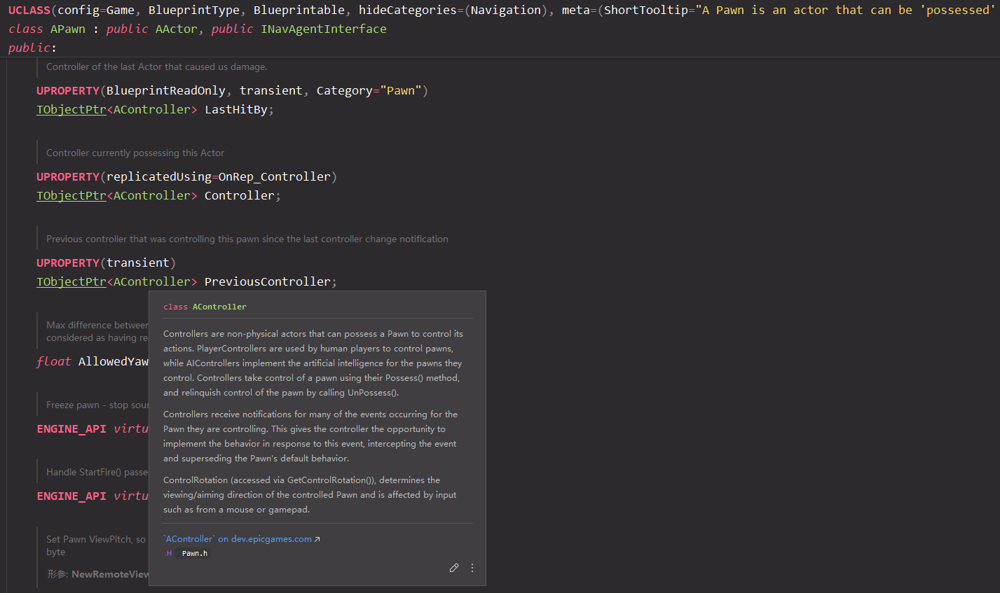

2. 具有比 AActor 更强大的输入管理

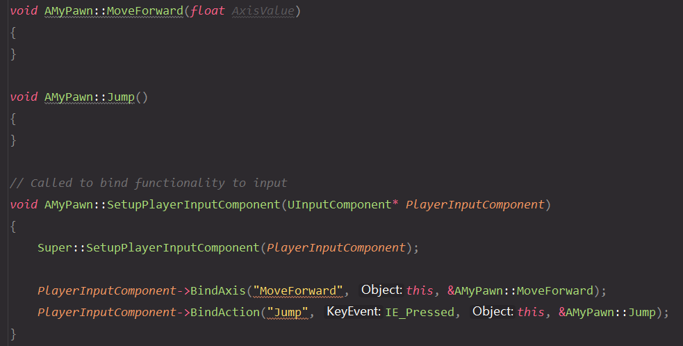

### Pawn的派生类

#### DefaultPawn

派生自Pawn，带有 DefaultPawnMovementComponent、CollisionComponent和StaticMeshComponent等

#### SpectatorPawn

派生自DefaultPawn，不带重力并关闭了StaticMesh，常用于观战视角

#### Character

派生自Pawn，带有 CharacterMovementComponent、CapsuleComponent、USkeletalMeshComponent等，常用于人型单位


### 参考文章

- [《InsideUE4》GamePlay架构（四）Pawn](https://zhuanlan.zhihu.com/p/23321666?refer=insideue4)


## Controller

> AController 派生自Actor，负责将 玩家/AI控制 作为系列行为指令 传递到所操控的Pawn


### Controller的核心功能

1. 接收、管理玩家/AI输入
2. 传递行为指令 到所操控的Pawn上
3. 协调网络同步：多人游戏中正确同步玩家状态

### Controller的派生类

#### APlayerController

**玩家控制** 的控制器，从玩家的输入设备（键盘、鼠标、游戏手柄等）获取输入、转换指令、传递到Pawn

涉及模块：

- Camera管理：通过`PlayerCameraManager`类以控制玩家相机
- Input系统
- UPlayer关联
- HUD显示：在控制器的相机前显示的UI
- Level切换
- Voice：网络语音


#### AAIController

**AI控制** 的控制器，从决策树、行为树（Behavior Tree）或其他 AI 逻辑来控制Pawn

涉及模块：

- Navigation
- AI组件
- Task系统


### 参考文章

- [《InsideUE4》GamePlay架构（五）Controller](https://zhuanlan.zhihu.com/p/23480071)

- [《InsideUE4》GamePlay架构（六）PlayerController和AIController](https://zhuanlan.zhihu.com/p/23649987)

- [UEGamePlay框架：Pawn，Controller，APlayerState](https://zhuanlan.zhihu.com/p/16087843925)


## Level、World

**Level** 是Actor的容器


**World** 由至少一个Level组成，负责Level的管理

Level在World内可分为2类：

- **Persistent Level（持久关卡）**：核心关卡，始终加载，负责管理其他子关卡的动态加载/卸载。通常为 包含基础场景元素（关照、天空盒）的Level
- **Streaming Levels（流送关卡）**：通过流送体积（Level Streaming Volumes）、蓝图或代码动态加载的子关卡，按需加载/卸载
  - 流送体积：当玩家进入体积区域时触发加载，离开时卸载
  - 蓝图/C++控制：使用`Load Stream Level`和`Unload Stream Level`函数控制
  - 固定加载（Always Loaded）：某些子关卡可能与持久关卡同时加载，常用于多人协作开发的分层设计


### 参考文章

- [《InsideUE4》GamePlay架构（二）Level和World - 知乎](https://zhuanlan.zhihu.com/p/22924838)
- [UE4 World, Level, LevelStreaming从入门到深入 - CSDN](https://blog.csdn.net/qq_29523119/article/details/145841523)
- [UE4中Info、LevelScriptActor和Level - 博客园](https://www.cnblogs.com/hxhspace/p/16132483.html)
- [关卡流送概述 - EnrealEngine](https://dev.epicgames.com/documentation/zh-cn/unreal-engine/level-streaming-overview-in-unreal-engine)


## GameMode

**GameMode** 负责处理游戏的 **基础规则、逻辑、流程**


涉及模块：

1. 核心Class登记：

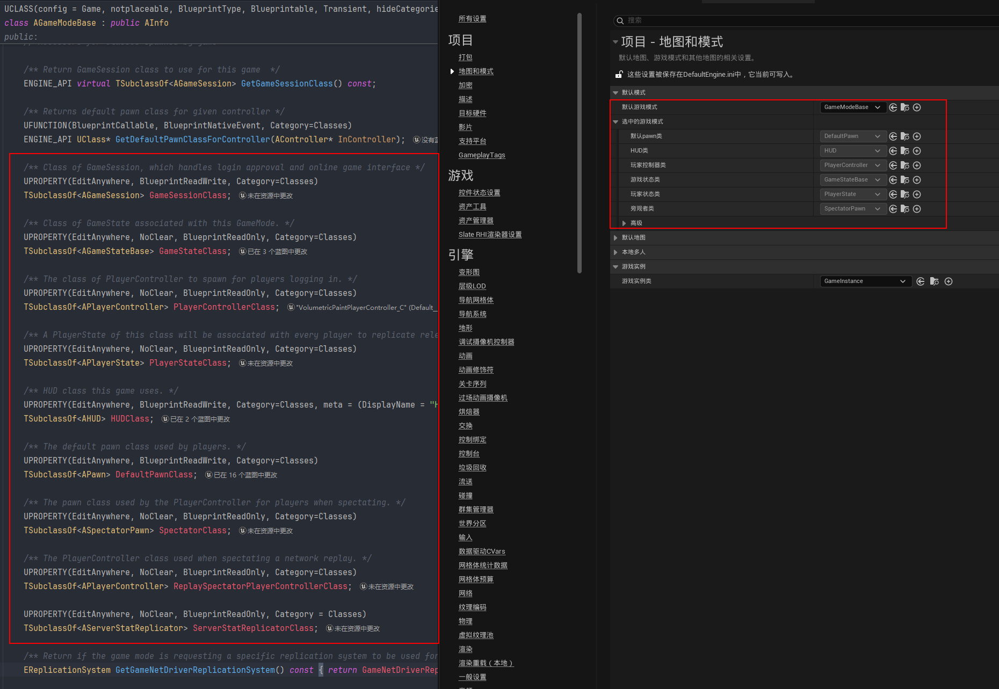

2. 游戏实体的Spawn：
   - 玩家的Pawn，PlayerController，AIController
3. 游戏进度控制：
   - 游戏的暂停、重启
4. Level的切换
5. 多人游戏的同步


### 创建及配置

从 `AGameModeBase` 即可派生出 自定义的GameMode

后可在C++层就登记Class；或是 又可派生出BP子类，在BP子类内登记Class（下图），优势在于 无需调整代码即可编辑

```c++
//AMyGameModeBase.cpp
#include "MyGameModeBase.h"

#include "MyGameStateBase.h"
#include "GameFramework/HUD.h"

AMyGameModeBase::AMyGameModeBase()
{
	GameStateClass = AMyGameStateBase::StaticClass();
	HUDClass = AHUD::StaticClass();
}
```

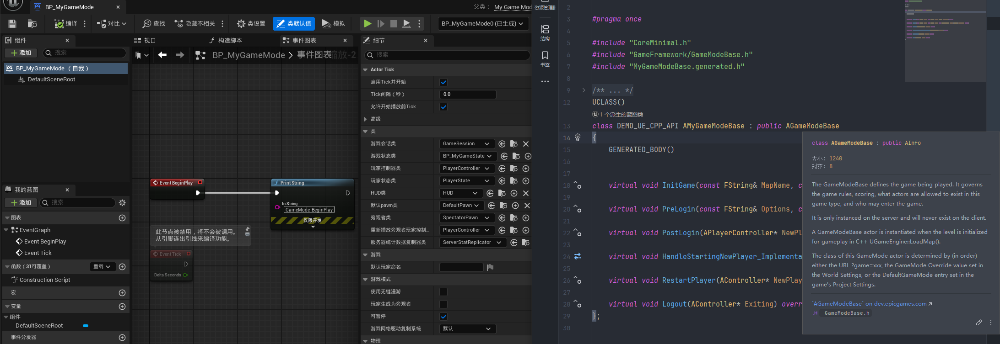

在实现自定义的GameMode后，可将其指定为 **默认的GameMode**。作用是 Level未指定GameMode下 默认使用此GameMode

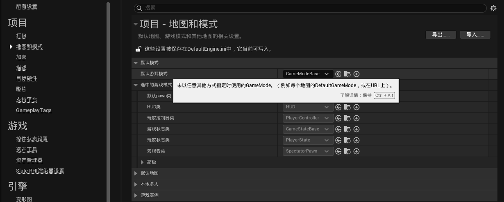

或将其指定为 **Level的 GameMode**。但注意 GameMode在World中仅存在唯一实例，在 Persistent Level+Streaming Levels 的情况下，仅会采用 Persistent Level 所指定的GameMode

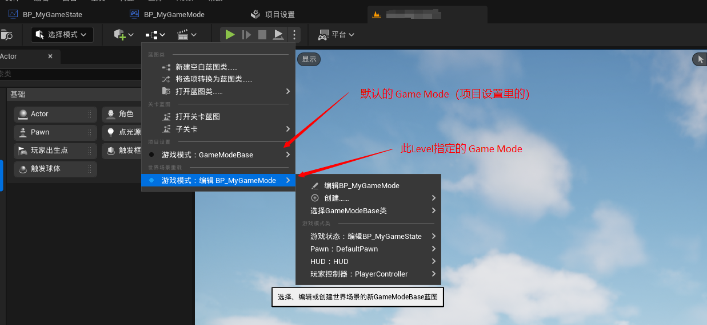


### 参考文章

- [《InsideUE4》GamePlay架构（七）GameMode和GameState](https://zhuanlan.zhihu.com/p/23707588)
- [Unreal Engine的Gameplay框架和重点 - 放牛的星星 - 知乎](https://zhuanlan.zhihu.com/p/612837045)
- [阿赵UE引擎C++编程学习笔记——GameMode和生命周期 - CSDN](https://blog.csdn.net/liweizhao/article/details/138141220)
- [UE5中GameMode、玩家角色等的设置与获取 - 知乎](https://zhuanlan.zhihu.com/p/560971474)
- [UEGamePlay框架：GameMode，GameState - 知乎](https://zhuanlan.zhihu.com/p/16089018768)
- [Game Mode 和 Game State - EnrealEngine](https://dev.epicgames.com/documentation/zh-cn/unreal-engine/game-mode-and-game-state-in-unreal-engine)


## GameState

**GameState** 负责管理、储存游戏的 **状态数据**。从概念上而言，GameState 应该管理所有已连接客户端已知的信息（特定于 Game Mode 但不特定于任何个体玩家）


### 参考文章

- [《InsideUE4》GamePlay架构（七）GameMode和GameState](https://zhuanlan.zhihu.com/p/23707588)
- [Unreal Engine的Gameplay框架和重点 - 放牛的星星 - 知乎](https://zhuanlan.zhihu.com/p/612837045)
- [UEGamePlay框架：GameMode，GameState - 知乎](https://zhuanlan.zhihu.com/p/16089018768)
- [Game Mode 和 Game State - EnrealEngine](https://dev.epicgames.com/documentation/zh-cn/unreal-engine/game-mode-and-game-state-in-unreal-engine)


## UPlayer、ULocalPlayer

**UPlayer** 是 管理、储存玩家信息的 辅助类，一个UPlayer可代表 一个玩家（本地或远程玩家）

> 本地玩家：通过本地设备输入的玩家
>
> 远程玩家：通过网络连接的玩家

主要功能：

- 管理玩家输入：各玩家的输入都传递到UPlayer
- 管理与玩家的连接：网络游戏内，UPlayer代表和管理各玩家的客户端连接
- 持有PlayerController


**ULocalPlayer** 派生自 UPlayer，负责处理 本地玩家 在单机游戏或本地多人游戏中的 输入、控制、会话管理等，一个ULoalPlayer代表 一个本地玩家

主要功能：

- 管理输入设备：从本地设备接收输入
- 管理玩家会话：跟踪玩家的输入、角色和游戏状态
- 区别开本地玩家与远程玩家：远程玩家由 UPlayer+APlayerController管理，本地玩家由ULocalPlayer管理
- 游戏视角控制：控制玩家视角、相机、输入绑定


### 参考文章

- [《InsideUE4》GamePlay架构（八）Player](https://zhuanlan.zhihu.com/p/23826859)
- [UEGamePlay框架：UPlayer，ULocalPlayer，UNetConnection - 知乎](https://zhuanlan.zhihu.com/p/16089379054)


## GameInstance

**GameInstance** 负责 管理游戏的生命周期、全局状态、跨Level数据的数据保存。其在整个游戏中 **全程唯一存在**，当游戏结束时才销毁

主要功能：

- 全局数据管理：例如 全局设置（分辨率、音量）、跨Level的数据（分数、存档）
- 与 主菜单、游戏模式的交互：加载主菜单、初始化网络连接、保存设置等
- 资源管理：管理全局资源（音频设置、网络设置、玩家设置等）


### 参考文章

- [《InsideUE4》GamePlay架构（九）GameInstance](https://zhuanlan.zhihu.com/p/24005952)
- [UEGamePlay框架：GameInstance - 知乎](https://zhuanlan.zhihu.com/p/16089742496)


## Subsystems

Subsystems是一套 可定义的类的框架，其能被UE 自动实例化 并 自动托管生命周期

目前可从UE预定义的5个父类派生：

- `UEngineSubsystem`

- `UEditorSubsystem`

- `UGameInstanceSubsystem`

- `UWorldSubsystem`

- `ULocalPlayerSubsystem`

Subsystems的作用：

- 实现类似 单例模式 的效果，同时 避免重复编写类似代码、避免自行管理生命周期
- 模块化：例如全局性的游戏系统，以往可在`UGameInstance`的派生类内写，现可以转到 各`UGameInstanceSubsystem`里写

### 示例

以 `UGameInstanceSubsystem` 为例，派生出 `UMyScoreSubsystem`：

```c++
//UMyScoreSubsystem.h
#include "CoreMinimal.h"
#include "Subsystems/GameInstanceSubsystem.h"
#include "MyScoreSubsystem.generated.h"

UCLASS()
class [PROJECTNAME]_API UMyScoreSubsystem : public UGameInstanceSubsystem
{
	GENERATED_BODY()

public:
	virtual bool ShouldCreateSubsystem(UObject* Outer) const override { return true; };
	virtual void Initialize(FSubsystemCollectionBase& Collection) override;
	virtual void Deinitialize() override;

	UFUNCTION(BlueprintCallable)
	void AddScore(float delta);

	UPROPERTY(EditAnywhere, BlueprintReadWrite)
	float Score;
};
```

可通过C++或蓝图进行访问

```c++
// 方法1：
UGameInstance* GameInstance = UGameplayStatics::GetGameInstance(GetWorld());
UMyScoreSubsystem* MyScoreSubsystem = GameInstance->GetSubsystem<UMyScoreSubsystem>();
MyScoreSubsystem->AddScore(1);
UE_LOG(LogTemp, Log, TEXT("MyScore = %f"), MyScoreSubsystem->Score);

// 方法2：通过USubsystemBlueprintLibrary内的API
UGameInstanceSubsystem* GameInstanceSySubsystem = USubsystemBlueprintLibrary::GetGameInstanceSubsystem(GetWorld(), UMyScoreSubsystem::StaticClass());
MyScoreSubsystem = Cast<UMyScoreSubsystem>(GameInstanceSySubsystem);
if (MyScoreSubsystem != nullptr)
{
    MyScoreSubsystem->AddScore(5);
    UE_LOG(LogTemp, Log, TEXT("MyScore = %f"), MyScoreSubsystem->Score);
}
```

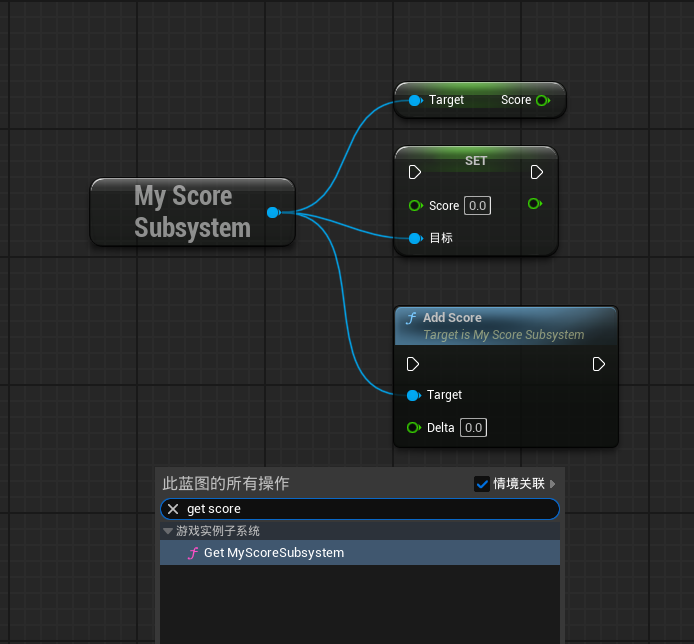

其他几类Subsystem的访问例如下：

```c++
// UMyEngineSubsystem
UMyEngineSubsystem* MySubsystem = GEngine->GetEngineSubsystem<UMyEngineSubsystem>();

// UMyEditorSubsystem
UMyEditorSubsystem* MySubsystem = GEditor->GetEditorSubsystem<UMyEditorSubsystem>();

// UMyGameInstanceSubsystem
UGameInstance* GameInstance = UGameplayStatics::GetGameInstance(...);
UMyGameInstanceSubsystem* MySubsystem = GameInstance->GetSubsystem<UMyGameInstanceSubsystem>();

// UMyWorldSubsystem
UWorld* World = MyActor->GetWorld();
UMyWorldSubsystem* MySubsystem=World->GetSubsystem<UMyWorldSubsystem>();

// UMyLocalPlayerSubsystem
ULocalPlayer* LocalPlayer = Cast<ULocalPlayer>(PlayerController->Player)
UMyLocalPlayerSubsystem * MySubsystem = LocalPlayer->GetSubsystem<UMyLocalPlayerSubsystem>();
```

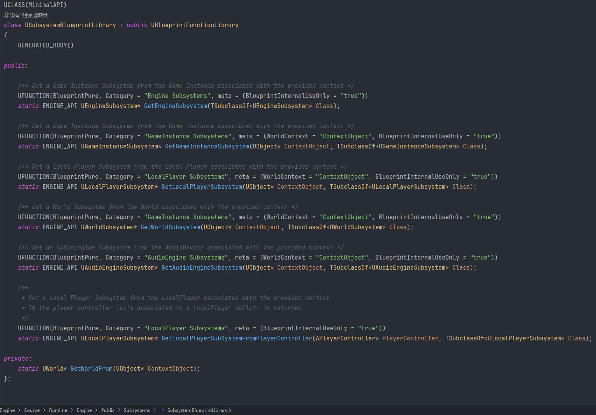

### 参考文章

- [《InsideUE4》GamePlay架构（十一）Subsystems](https://zhuanlan.zhihu.com/p/158717151)


## SaveGame、LoadGame

通过对 `USaveGame` 或其派生类进行 序列化/反序列化 到本地，实现存档/读档 机制

存档文件 `XXX.sav`，默认位于 项目根目录/Saved/SaveGames 内

|      类型       |              适用情景              | 备注 |
| :-------------: | :--------------------------------: | :--: |
|  同步保存/加载  |        数据量小、游戏暂停时        |      |
|  异步保存/加载  | 数据量大、游戏非暂停、需要避免卡顿 |      |
| 二进制保存/加载 |                                    |      |

以 [UGameplayStatics::SaveGameToSlot](https://dev.epicgames.com/documentation/en-us/unreal-engine/API/Runtime/Engine/Kismet/UGameplayStatics/SaveGameToSlot?application_version=5.5) 为例，存读档相关API的核心参数说明：

- `FString & SlotName`：存档名，辨别此份存档的唯一名称，且本地存档文件`.sav`的前缀也同此。建议一个存档一个名字
- `int32 UserIndex`：用户平台ID。可自行设置参数 以标识不同平台，但通常不用刻意设定

```c++
UFUNCTION (BlueprintCallable, Category="SaveGame")  
static bool SaveGameToSlot  
(  
    USaveGame * SaveGameObject,  
    const FString & SlotName,  
    const int32 UserIndex  
)
```

### 示例

以 同步保存 为例，其在C++层或蓝图层的实现：

```c++
//UMySaveGame.h
UCLASS()
class [PROJECTNAME]_API UMySaveGame : public USaveGame
{
	GENERATED_BODY()

public:
	UPROPERTY(EditAnywhere, BlueprintReadWrite, Category = Basic)
	FString PlayerName;

	UPROPERTY(VisibleAnywhere, BlueprintReadWrite, Category = Basic)
	FString SaveSlotName;

	UPROPERTY(VisibleAnywhere, Category = Basic)
	uint32 UserIndex;

	UMySaveGame();
};

//同步存档
if (UMySaveGame* SaveGameInstance = Cast<UMySaveGame>(UGameplayStatics::CreateSaveGameObject(UMySaveGame::StaticClass())))
{
    // 修改存档实例的 数据
    SaveGameInstance->PlayerName = TEXT("Player");
    SaveGameInstance->SaveSlotName = TEXT("SaveSlot_00");
    SaveGameInstance->UserIndex = 0;

    // 保存
    FString SlotNameString = TEXT("SaveSlot_00");
    int32 UserIndexInt32 = 0;
    if (UGameplayStatics::SaveGameToSlot(SaveGameInstance, SlotNameString, UserIndexInt32))
    {
        // 保存成功
    }
}
```

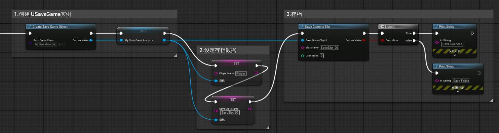

### 参考文章

- [保存和加载游戏 - UnRealEngine](https://dev.epicgames.com/documentation/zh-cn/unreal-engine/saving-and-loading-your-game-in-unreal-engine?application_version=5.5)
- [UGameplayStatics::SaveGameToSlot - UnrealEngineAPI](https://dev.epicgames.com/documentation/en-us/unreal-engine/API/Runtime/Engine/Kismet/UGameplayStatics/SaveGameToSlot?application_version=5.5)
- [Save Game - what User Index is for? - UnrealEngineDev](https://forums.unrealengine.com/t/save-game-what-user-index-is-for/319803)
- [保存和加载游戏 - 博客园](https://www.cnblogs.com/CodeWithMe/p/13201689.html)


# GamePlay框架的 Runtime启动流程

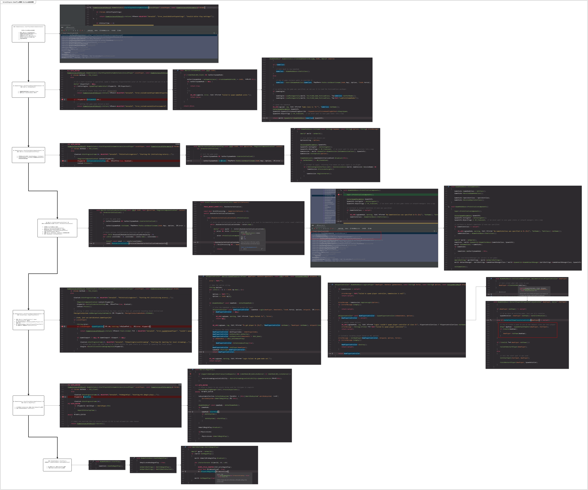

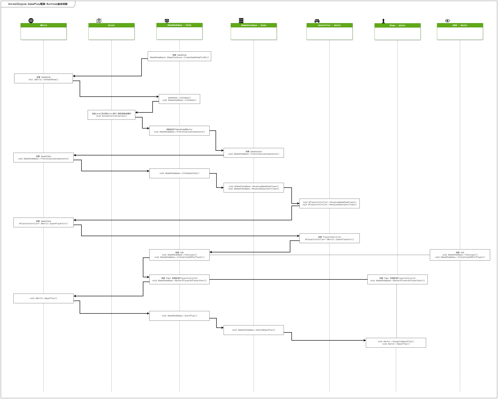

## 参考文章

- [Unreal Engine 的启动流程 - 放牛的星星 - 知乎](https://zhuanlan.zhihu.com/p/610523485)
- [UE4 Gameplay之GameMode流程分析(一) - 孤傲雕 - 知乎](https://zhuanlan.zhihu.com/p/70045930)


# GAS

>  **Gameplay技能系统（Gameplay Ability System）** 是一种框架，用于编译`Actor`可以拥有和触发的属性、技能和交互
>
> 该系统可适应各种各样的[Gameplay驱动型](https://dev.epicgames.com/documentation/zh-cn/unreal-engine/data-driven-gameplay-elements-in-unreal-engine?application_version=5.4)项目，例如 **角色扮演游戏** （RPG）、 **动作冒险（Action-Adventure）** 游戏和 **多玩家在线战术竞技** 游戏（MOBA）
>
> 通过GAS，可以快速制作游戏内的 主动/被动技能、Buff效果、伤害计算、战斗状态逻辑等

GAS核心模块：

- Ability System Component 技能系统组件
- GameplayTags 游戏标签
- Gameplay Ability


## Ability System Component（ASC）

ASC本质是一个 `UActorComponent`，用于处理 GAS框架下的 交互逻辑：

- 使用技能（GamePlayAbility）
- 属性设置（AttributeSet）
- 效果处理（GamePlayEffect）

任何需要使用GAS的Actor对象，都必须拥有ASC组件（可将其放到Actor或PlayerState上）

ASC所附着的Actor称为 ASC的`OwnerActor`，ASC实际作用的Actor称为 ASC的`AvatarActor`

### 用法-基本配置

首先确保项目启用了GAS插件，后即可配置ASC组件：例如 在目标Actor上添加ASC组件，并继承实现`IAbilitySystemInterface`接口

```c++
// AGASSampleCharacter.h
class AGASSampleCharacter : public ACharacter, public IAbilitySystemInterface
{
    // 申明ASC
	UPROPERTY(VisibleAnywhere, BlueprintReadOnly, Category = GameplayAbilities, meta = (AllowPrivateAccess = "true"))
	class UAbilitySystemComponent* AbilitySystem;
    
    // 实现IAbilitySystemInterface接口
	UAbilitySystemComponent* GetAbilitySystemComponent() const override;
}
```

```c++
// AGASSampleCharacter.cpp
AGASSampleCharacter::AGASSampleCharacter()
{
	// 实例化ASC
	AbilitySystem = CreateDefaultSubobject<UAbilitySystemComponent>(TEXT("AbilitySystem"));
}

UAbilitySystemComponent* AGASSampleCharacter::GetAbilitySystemComponent() const
{
    // 实现IAbilitySystemInterface接口，返回ASC实例
	return AbilitySystem;
}
```

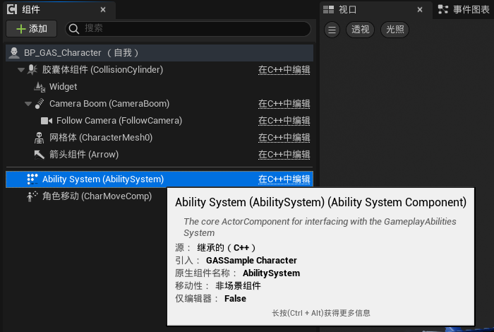

## Gameplay Tags

`FGameplayTags` 是一种 **树状层级标签**，用于表示GAS内的 **某一种或某一类 状态/效果**

其基本结构例如 `Parent.Child.GrandChild`，其每一层都是一种标签，可粗略可细化，替代了常规的 `Bool`、`Enum`等多重嵌套、结合的结构

GameplayTags的管理位于 项目设置->项目->GameplayTags 内，对应配置亦被保存在 DefaultGameplayTags.ini 文件内

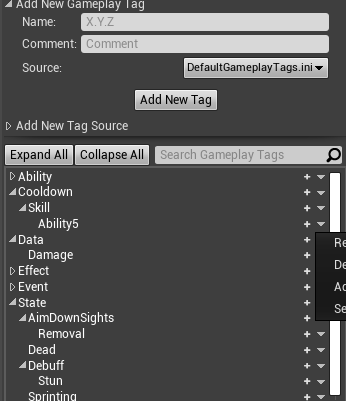


## Gameplay Ability（GA）

`UGameplayAbility` 表示 **一段可被 激活触发的 游戏逻辑**

GA可用于表示 攻击、被攻击、技能等，甚至于 角色跳跃、物品交互等

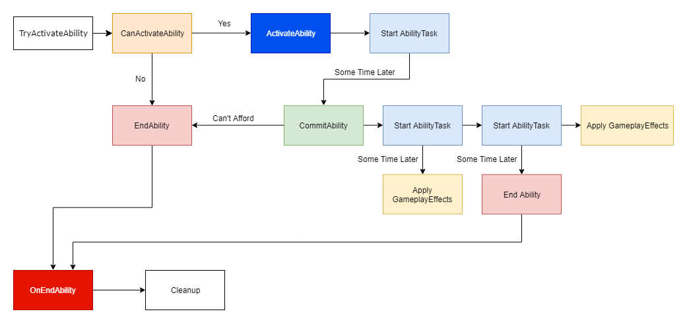

### 用法

#### 1. 创建GA

以从 `UGamePlayAbility` 派生GA蓝图为例，GA蓝图的基本结构如下：

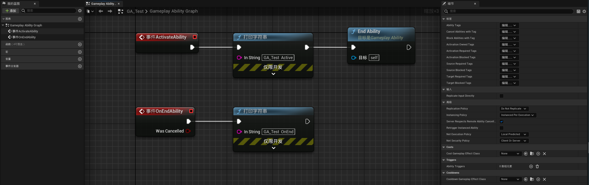

GA的职责：

- 生命周期事件：

  - `事件ActivateAbility`：激活触发此GA后，通知到此事件，相当于GA逻辑的入口

  - `事件OnEndAbility`：GA结束事件
  - `EndAbility`：结束GA的方法

- 配置 GameplayTags、Cost、CoolDowns等属性

- 业务逻辑：视觉表现、应用GE等

#### 2. 添加GA到ASC

常规方法是 在C++层 把GA添加到ASC组件内、初始化ASC，则后续ASC就可使用此GA

```c++
// AGASSampleCharacter.h
class AGASSampleCharacter : public ACharacter, public IAbilitySystemInterface
{
    // ASC
	UPROPERTY(VisibleAnywhere, BlueprintReadOnly, Category = GameplayAbilities, meta = (AllowPrivateAccess = "true"))
	class UAbilitySystemComponent* AbilitySystem;

    // 声明Ability数组
	UPROPERTY(EditAnywhere, BlueprintReadWrite, Category = Abilities)
	TArray<TSubclassOf<UGameplayAbility>> MyAbilities;
}
```

```c++
// AGASSampleCharacter.cpp
void AGASSampleCharacter::BeginPlay()
{
	Super::BeginPlay();

	if (nullptr != AbilitySystem)
	{
		// 把GA添加到ASC
		if (MyAbilities.Num() > 0)
		{
			for (auto i = 0; i < MyAbilities.Num(); i++)
			{
				if (MyAbilities[i] == nullptr)
					continue;

				AbilitySystem->GiveAbility(FGameplayAbilitySpec(MyAbilities[i].GetDefaultObject(), 1, 0));
			}
		}

		// 初始化ASC
		AbilitySystem->InitAbilityActorInfo(this, this);
	}
}
```

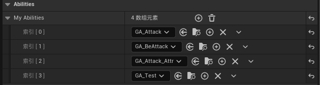

#### 3. GA的激活

激活某个GA的方式有：

A. 主动调用ASC组件提供的 `TryActivateAbilityByClass`、`TryActivateAbilitiesByTag` 方法

B. GA自身配置Trigger条件，当ASC收到Trigger后将触发激活 其拥有的、满足Trigger条件的 GA。常用方法是 `UAbilitySystemBlueprintLibrary::SendGameplayEventToActor`

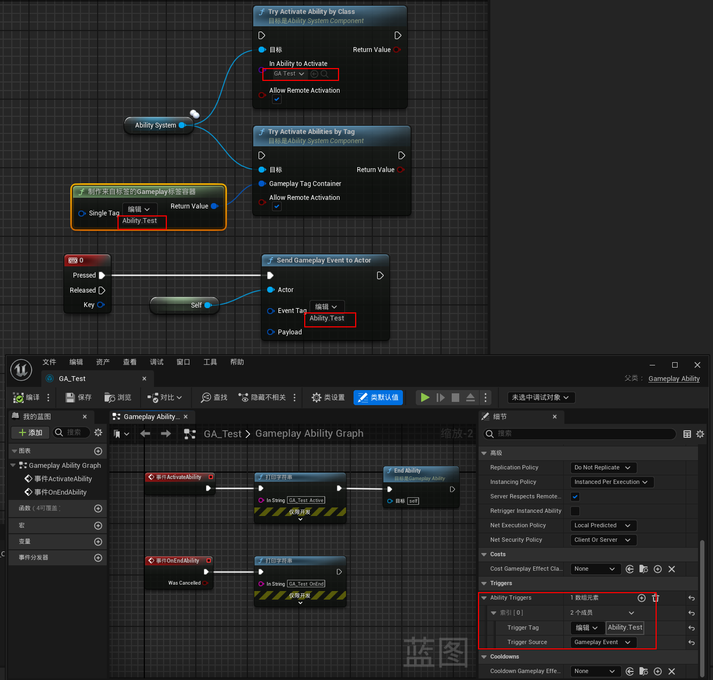

### GA - Tags标签

GA上可配置系列 GameplayTags，使其进行 预设的逻辑处理

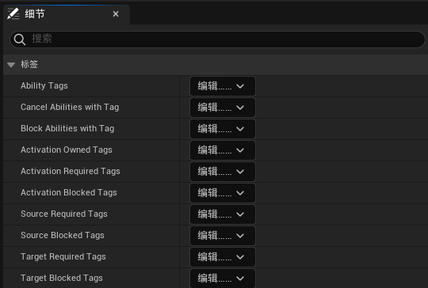

|           名称            |                             描述                             |                        备注                        |
| :-----------------------: | :----------------------------------------------------------: | :------------------------------------------------: |
|       Ability Tags        |              此GA 的 Tags（即 描述GA用的标签）               |                                                    |
| Cancel Abilities with Tag |      当此GA激活时 打断其他所有 拥有配置AbilityTags的GA       |           此类Tag是 某个GA的AbilityTags            |
| Block Abilities with Tag  | 当此GA激活时 其他所有 拥有配置AbilityTags的GA 禁止激活（已激活了的不会被打断） |           此类Tag是 某个GA的AbilityTags            |
|   Activation Owned Tags   | 当此GA激活时 GA的 `AvatarActor` 的ASC 将获取 配置的Tags，反之 当GA结束时 将对应移除 | 此类Tag是附属于ASC上的，而不是 某个GA的AbilityTags |
| Activation Required Tags  | 当GA的 `AvatarActor` 的ASC上 拥有全部 配置的Tags，则此GA才允许被激活 | 此类Tag是附属于ASC上的，而不是 某个GA的AbilityTags |
|  Activation Blocked Tags  | 若此GA的 `AvatarActor` 的ASC上 拥有任意个 配置的Tags，则此GA禁止激活 | 此类Tag是附属于ASC上的，而不是 某个GA的AbilityTags |
|   Source Required Tags    | 当`FGameplayEventData.InstigatorTags` 内 包含全部 配置的Tags，则此GA才允许被激活 |                                                    |
|    Source Blocked Tags    | 当`FGameplayEventData.InstigatorTags` 内 拥有任意个 配置的Tags，则此GA禁止激活 |                                                    |
|   Target Required Tags    | 当`FGameplayEventData.TargetTags` 内 包含全部 配置的Tags，则此GA才允许被激活 |                                                    |
|    Target Blocked Tags    | 当`FGameplayEventData.TargetTags` 内 拥有任意个 配置的Tags，则此GA禁止激活 |                                                    |

#### 关于 Source XXX Tags、Target XXX Tags

当我们采用 **[GameplayEvent的形式激活GA](https://dev.epicgames.com/documentation/en-us/unreal-engine/using-gameplay-abilities-in-unreal-engine?application_version=5.4#triggeringwithgameplayevents)**（例如调用方法 `UAbilitySystemBlueprintLibrary::SendGameplayEventToActor(AActor* Actor, FGameplayTag EventTag, FGameplayEventData Payload)`，其中的形参 `FGameplayEventData Payload` 其内的下列2成员参数，即对应 Source XXX Tags、Target XXX Tags

```c++
/** Metadata for a tag-based Gameplay Event, that can activate other abilities or run ability-specific logic */
USTRUCT(BlueprintType)
struct GAMEPLAYABILITIES_API FGameplayEventData
{
    // ...
    
	/** Tags that the instigator has */
	UPROPERTY(EditAnywhere, BlueprintReadWrite, Category = GameplayAbilityTriggerPayload)
	FGameplayTagContainer InstigatorTags;

    /** Tags that the target has */
	UPROPERTY(EditAnywhere, BlueprintReadWrite, Category = GameplayAbilityTriggerPayload)
	FGameplayTagContainer TargetTags;
    
    // ...
}
```

而当 **非GameplayEvent的形式激活GA的情况**，例如常用的 `UAbilitySystemComponent::TryActivateAbilityByClass()` 其内部流程中 未创建使过`FGameplayEventData`类型的数据，因此这类方法 **会跳过对 Source XXX Tags、Target XXX Tags 的判断**，核心代码位于：

```c++
//AbilitySystemComponent_Abilities.cpp
bool UAbilitySystemComponent::InternalTryActivateAbility(FGameplayAbilitySpecHandle Handle, FPredictionKey InPredictionKey, UGameplayAbility** OutInstancedAbility, FOnGameplayAbilityEnded::FDelegate* OnGameplayAbilityEndedDelegate, const FGameplayEventData* TriggerEventData)
{
    // Core ...
}
```

一个例子：

1. 已有一个目标GA：TargetBlockedTags=`Ability.Test.A`，其带有GameplayEvent的Trigger（TriggerTag=`Ability.Test.C`）
2. 现通过 GameplayEvent的形式 尝试激活目标GA：激活的EventTag对应为`Ability.Test.C`，其将传递 `FGameplayEventData Payload` 参数（其TargetTags配置为`Ability.Test.B`）
3. 执行结果为 因TargetTags内配置的Tags，均不在 GA的TargetBlockedTags列表内，故 成功激活GA
4. 若将 TargetTags从`Ability.Test.B`改配置为`Ability.Test.A`，则执行结果为 因TargetTags内配置的Tags，有存在于 GA的TargetBlockedTags列表内，故 将被阻止激活GA。其余同理

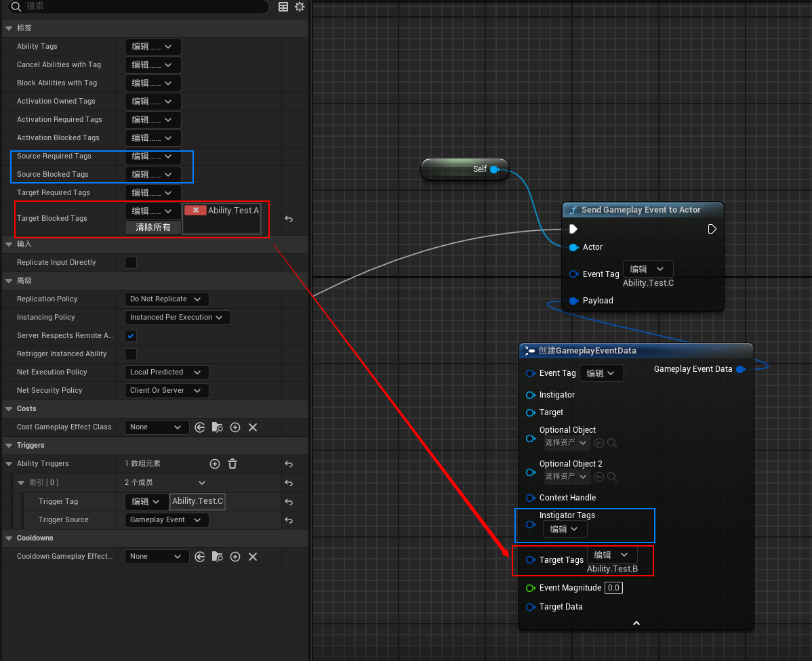

总结：

- Source XXX Tags、Target XXX Tags 仅在 通过GameplayEvent激活GA 且有对应非空`Payload`配置下 才可能生效，否则GA的配置无需关心这2项目的内容


### GA - Triggers触发器

触发器用于 配置系列触发条件、当达成触发条件后 就激活此GA

**TriggerTag**：即 触发激活此GA的 标识GameplayTag

**Triggers Source**：

- Gameplay Event：当`OwnerActor`收到 配置TriggerTag的Gameplay Event时（例如 `UAbilitySystemBlueprintLibrary::SendGameplayEventToActor(AActor* Actor, FGameplayTag EventTag, FGameplayEventData Payload)`）激活一次此GA
- Owned Tag Added：当`OwnerActor`获得 配置TriggerTag的时候 激活一次此GA，当`OwnerActor`失去此Tag时 不会移除此GA，需要自行移除
- Owned Tag Present：当`OwnerActor`获得 配置TriggerTag的时候 激活一次此GA，当`OwnerActor`失去此Tag时 会自动移除此GA（GA若执行未完成会被Cancel）


## 参考文章

- [Gameplay技能系统 - UnrealEngine](https://dev.epicgames.com/documentation/zh-cn/unreal-engine/gameplay-ability-system-for-unreal-engine?application_version=5.4)
- [虚幻引擎游戏技能系统文档 - CSDN](https://blog.csdn.net/pirate310/article/details/106311256)
- [【Unreal】虚幻GAS系统快速入门 - 知乎](https://zhuanlan.zhihu.com/p/486808688)
- [UE5 GAS Base - CSDN](https://blog.csdn.net/qq_52179126/article/details/131860252)
