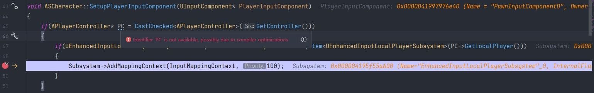
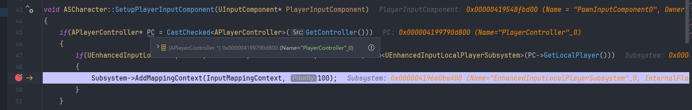

# UnrealWorld

记录 **[Unreal Engine](https://www.unrealengine.com/zh-CN)** 相关内容

## 项目

### [Demo_UE_BP_NetEase](https://github.com/SouthBegonia/Demo_UE_BP_NetEase/)

蓝图入门学习项目，涉及 蓝图基础用法、蓝图对[UE Gameplay框架](https://dev.epicgames.com/documentation/zh-cn/unreal-engine/gameplay-framework-in-unreal-engine)的简单实现

## 文档

Unreal Engine 综合类文档：[Doc_UE](https://github.com/SouthBegonia/UnrealWorld/tree/main/Doc_UE)

Unreal Engine GamePlay相关文档：[Doc_UE_GamePlay](https://github.com/SouthBegonia/UnrealWorld/tree/main/Doc_UE_GamePlay)

## IDE

### Visual Studio

作为UE官方首推的IDE，各方面都与UE适配较好。除了用IDE编写代码，更重要的是需要用到 MSVC、MSBuild等工具及C++环境，以便于构建方案，因此 **建议VS必装**

- 版本推荐：
  - Visual Studio 2022

- 安装方法：
  - [设置Visual Studio - UnrealEngine](https://dev.epicgames.com/documentation/zh-cn/unreal-engine/setting-up-visual-studio-development-environment-for-cplusplus-projects-in-unreal-engine)
  - [【UE5.1 C++】VS2022下载安装 - CSDN](https://blog.csdn.net/ChaoChao66666/article/details/137961824)

### Rider

目前UE跟Rider已经相互支持，且Rider已经免费（非商业用途），所以也可选用Rider作为IDE

- 版本推荐：
  - UE5 + Rider 2025+

- 安装方法：
  - [UE5 + Rider 配置调试，修改代码操作 - 知乎](https://zhuanlan.zhihu.com/p/8648285372)
    - 备注1：UE编辑器偏好设置->码编辑器设置 选Rider Uproject，而不是Rider
    - 备注2：UE5+Rider打开解决方案时，选择 在游戏中安装 RiderLink插件，而不是 在引擎中安装。若控制台最终提示RiderLink插件安装失败，可能为Rider的问题，可尝试升级Rider版本或重装Rider
  - [rider-for-unreal - Jetbrains](https://www.jetbrains.com/guide/gamedev/tutorials/rider-for-unreal/)

- 其他：
  - [如何使用rider调试UE引擎的源代码 - CSDN](https://blog.csdn.net/weixin_45685193/article/details/135372792)
  - [Rider 使用技巧总结 - 知乎](https://zhuanlan.zhihu.com/p/569938186)

### IDE相关

1. 关闭UE代码优化以便Debug时查看变量信息：

- [UE 如何关闭代码优化 - 知乎](https://zhuanlan.zhihu.com/p/563164847)
- [变量已被优化，因而不可用 - 虚幻社区知识库](https://ue5wiki.com/wiki/12876/)

2. 新版本UE（更高或更低版本）创建C++工程失败，报错内容例如 [UE--VS2022编译UE项目出现 error C4668: 没有将“__has_feature”定义为预处理器宏，用“0”替换“#if/#elif”](https://blog.csdn.net/qq_59398646/article/details/144143000)：

   根本原因是 不同UE版本所必需的MSVC版本不同（UE版本越高，MSVC通常也对应更高）。因此针对多UE版本的开发环境，需要用VS Installer安装多个版本的MSVC组件，参考：[UE5 5.1.1创建C++项目，显示error C4668和error C4067的解决方法 - CSDN](https://blog.csdn.net/cat_want_fly/article/details/143869347)

## 其他

- [C++笔记](https://github.com/SouthBegonia/Computer-Course/tree/master/Programming%20Languages/CPP)